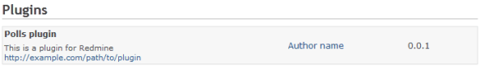
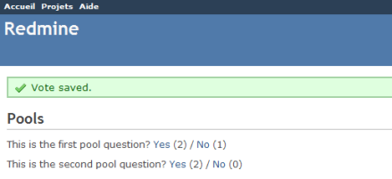
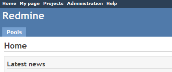
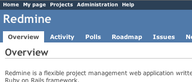
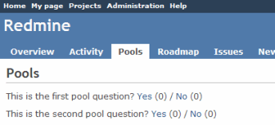
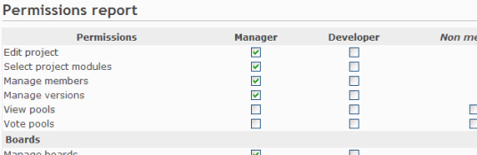
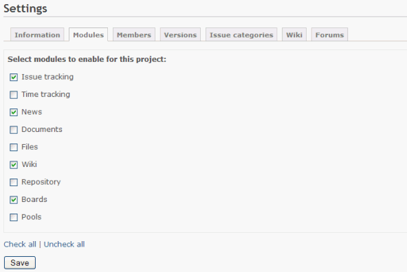
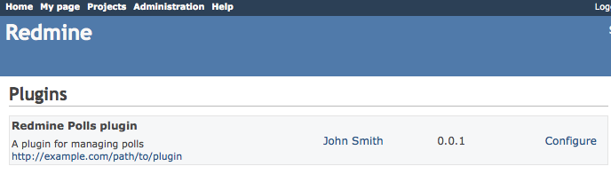
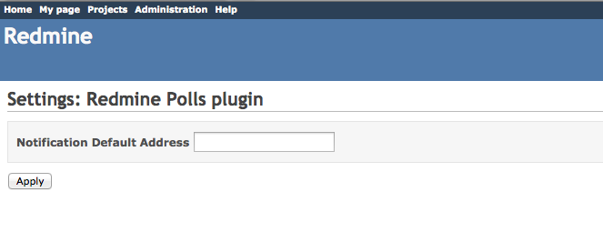

プラグイン チュートリアル
=========================

!!! note ""
    最終更新: 2014/08/17
    [[原文](http://www.redmine.org/projects/redmine/wiki/Plugin_Tutorial/93)]


このチュートリアルは Redmine 2.x に基づいています。旧バージョン (Redmine 1.x) のチュートリアルについては [こちら](http://www.redmine.org/projects/redmine/wiki/Plugin_Tutorial?version=66) をご覧ください。このチュートリアルでは Ruby on Rails フレームワーク の経験があることを前提としています。

新しいプラグインの作成
----------------------

この後で実行するコマンドを利用するためにRAILS\_ENV変数を定義する必要がある場合があります:

``` shell
$ export RAILS_ENV="production"
```

Windowsの場合:

``` shell
$ set RAILS_ENV=production
```

プラグインの新規作成はRedmineプラグインジェネレータが利用できます。ジェネレータの構文は以下の通りです:

``` shell
ruby script/rails generate redmine_plugin <plugin_name>
```

コマンドプロンプトを開き "cd" コマンドで redmineのディレクトリに移動し、以下のコマンドを実行してください:

``` text
$ ruby script/rails generate redmine_plugin Polls
      create  plugins/polls/app
      create  plugins/polls/app/controllers
      create  plugins/polls/app/helpers
      create  plugins/polls/app/models
      create  plugins/polls/app/views
      create  plugins/polls/db/migrate
      create  plugins/polls/lib/tasks
      create  plugins/polls/assets/images
      create  plugins/polls/assets/javascripts
      create  plugins/polls/assets/stylesheets
      create  plugins/polls/config/locales
      create  plugins/polls/test
      create  plugins/polls/README.rdoc
      create  plugins/polls/init.rb
      create  plugins/polls/config/routes.rb
      create  plugins/polls/config/locales/en.yml
      create  plugins/polls/test/test_helper.rb
```

プラグインのひな型が `plugins/polls` に作成されます。 `plugins/polls/init.rb` を編集して作成するプラグインの情報を書き込んでください (名称、作者、説明 および バージョン):

``` ruby
Redmine::Plugin.register :polls do
  name 'Polls plugin'
  author 'John Smith'
  description 'A plugin for managing polls'
  version '0.0.1'
end
```

その後、Redmineを再起動してwebブラウザで <http://localhost:3000/admin/plugins> にアクセスしてください。ログイン後、作成したプラグインが一覧に追加されていることが確認できるはずです:



Note: プラグインの `init.rb` はリクエストごとにリロードされるわけではないので、変更を反映させるにはRedmineの再起動が必要です。

モデルの作成
------------

今のところプラグインは空です。それでは我々のプラグインに単純なPollモデルを作ってみましょう。構文は以下の通りです:

``` text
ruby script/rails generate redmine_plugin_model <plugin_name> <model_name> [field[:type][:index] field[:type][:index] ...]
```

コマンドプロンプトを開いて以下を実行してください:

``` text
$ ruby script/rails generate redmine_plugin_model polls poll question:string yes:integer no:integer
      create  plugins/polls/app/models/poll.rb
      create  plugins/polls/test/unit/poll_test.rb
      create  plugins/polls/db/migrate/001_create_polls.rb
```

Pollモデルが作成され、それに対応したマイグレーションファイル `001_create_polls.rb` が `plugins/polls/db/migrate` に作成されます:

``` ruby
class CreatePolls < ActiveRecord::Migration
  def change
    create_table :polls do |t|
      t.string :question
      t.integer :yes, :default => 0
      t.integer :no, :default => 0
    end
  end
end
```

マイグレーションファイルは適宜変更してもかまいません(例: デフォルト値など)。そして以下のコマンドでデータベースマイグレーションを実行します:

``` text
$ rake redmine:plugins:migrate

Migrating polls (Polls plugin)...
==  CreatePolls: migrating ====================================================
-- create_table(:polls)
   -> 0.0410s
==  CreatePolls: migrated (0.0420s) ===========================================
```

マイグレーションファイル一式はそれぞれのプラグインが保持されています。

それでは試しにconsoleにPollデータを追加してみましょう。
consoleを使うと対話的に動作確認ができます。また、いじりながらいろいろな情報を得ることができます。とりあえず、今は二つのPollオブジェクトを作ります:

``` text
ruby script/rails console
[rails 3] rails console
>> Poll.create(:question => "Can you see this poll")
>> Poll.create(:question => "And can you see this other poll")
>> exit
```

プラグインディレクトリ内の `plugins/polls/app/models/poll.rb` を編集して、コントローラから呼び出される\#voteメソッドを追加してみましょう:

``` ruby
class Poll < ActiveRecord::Base
  def vote(answer)
    increment(answer == 'yes' ? :yes : :no)
  end
end
```

コントローラの作成
------------------

今のところこのプラグインは何もできません。プラグインにコントローラを追加してみましょう。コントローラの作成にはプラグインコントローラジェネレータを使います。構文は以下の通りです:

``` shell
ruby script/rails generate redmine_plugin_controller <plugin_name> <controller_name> [<actions>]
```

``` text
$ ruby script/rails generate redmine_plugin_controller Polls polls index vote
      create  plugins/polls/app/controllers/polls_controller.rb
      create  plugins/polls/app/helpers/polls_helper.rb
      create  plugins/polls/test/functional/polls_controller_test.rb
      create  plugins/polls/app/views/polls/index.html.erb
      create  plugins/polls/app/views/polls/vote.html.erb
```

コントローラ `PollsController` と二つのアクション (`#index` と `#vote`) ができます。

`plugins/polls/app/controllers/polls_controller.rb` を編集して二つのアクションを実装してください。

``` ruby
class PollsController < ApplicationController
  unloadable

  def index
    @polls = Poll.all
  end

  def vote
    poll = Poll.find(params[:id])
    poll.vote(params[:answer])
    if poll.save
      flash[:notice] = 'Vote saved.'
    end
    redirect_to :action => 'index'
  end
end
```

そして `plugins/polls/app/views/polls/index.html.erb` を編集して先ほど作成したPollモデルのデータを表示させましょう:

``` erb
<h2>Polls</h2>

<% @polls.each do |poll| %>
  <p>
  <%= poll.question %>?
  <%= link_to 'Yes', { :action => 'vote', :id => poll[:id], :answer => 'yes' }, :method => :post %> (<%= poll.yes %>) /
  <%= link_to 'No', { :action => 'vote', :id => poll[:id], :answer => 'no' }, :method => :post %> (<%= poll.no %>)
  </p>
<% end %>
```

`#vote` アクションではビューのレンダリングは行われないので `plugins/polls/app/views/polls/vote.html.erb` は削除してもかまいません。

### ルートの追加

Redmineはデフォルトのワイルドカードルート(`':controller/:action/:id'`)は提供していません。プラグインは必要なルートを `config/routes.rb` で宣言する必要があります。 `plugins/polls/config/routes.rb` を編集して二つのアクションのための二つのルートを追加してください:

``` ruby
get 'polls', :to => 'polls#index'
post 'post/:id/vote', :to => 'polls#vote'
```

Railsのルートについての詳細は次のURLを参照してください: <http://guides.rubyonrails.org/routing.html>

さて、Redmineを再起動して、ブラウザから <http://localhost:3000/polls> にアクセスしてみましょう。画面に二つのアンケートが表示され、投票が行えるはずです:



国際化
------

翻訳用ファイルは `plugins/polls/config/locales/` 、すなわちプラグインの config/locales に格納しなければなりません。

メニューの拡張
--------------

コントローラはうまく動くようになりましたが、URLが分からなければアクセスできません。RedmineのプラグインAPIを使うと、メニューを拡張することができます。
それでは、アプリケーションメニューに項目を追加してみましょう。

### アプリケーションメニューの拡張

`plugins/polls/init.rb` を編集し、プラグインの登録を行っているブロックの最後に以下の行を追加してください:

``` ruby
Redmine::Plugin.register :redmine_polls do
  [...]

  menu :application_menu, :polls, { :controller => 'polls', :action => 'index' }, :caption => 'Polls'
end
```

構文は次の通りです:

``` ruby
menu(menu_name, item_name, url, options={})
```

拡張できるのは以下の5個のメニューです:

-   `:top_menu` - 画面左上のメニュー
-   `:account_menu` - 画面右上のログイン/ログアウトのリンクがあるメニュー
-   `:application_menu` - プロジェクト外にいるときに表示されるメインメニュー
-   `:project_menu` - プロジェクト内にいるときに表示されるメインメニュー
-   `:admin_menu` - 「管理」画面のメニュー (「設定」と「プラグイン」の間にのみ追加できます)

以下のオプションが使えます:

-   `:param` - プロジェクトIDに使用されるキー (デフォルトは `:id`)
-   `:if` - メニュー項目のレンダリング前に呼ばれるProcで、そのProcが真を返したときのみメニュー項目が表示される
-   `:caption` - メニューのキャプション。以下が使えます:
    -   翻訳ファイル内で定義したローカライズ用のシンボル
    -   文字列
    -   プロジェクトを引数とするProc
-   `:before`, `:after` - メニューの項目が挿入される位置の指定 (例 `:after => :activity`)
-   `:first`, `:last` - trueを設定するとメニューの先頭/末尾に追加される (例 `:last => true`)
-   `:html` - HTMLオプションのハッシュで、メニューの項目を表示する際に `link_to` に渡される。

この例では、デフォルトでは空であるアプリケーションメニューに追加してみます。
Redmineを再起動して <http://localhost:3000> にアクセスしてください:



Welcome画面の「Polls」タブをクリックするとアンケートの画面に行けます。

### プロジェクトメニューの拡張

さて、アンケートがプロジェクトごとに作成されると仮定しましょう (現時点のプラグインのPollモデルはそのようにはなっていませんが)。「Poll」タブをアプリケーションメニューではなくプロジェクトメニューに追加してみます。 `init.rb` を開いて先ほど追加した行を以下の2行に置き換えてください:

``` ruby
Redmine::Plugin.register :redmine_polls do
  [...]

  permission :polls, { :polls => [:index, :vote] }, :public => true
  menu :project_menu, :polls, { :controller => 'polls', :action => 'index' }, :caption => 'Polls', :after => :activity, :param => :project_id
end
```

2行目がプロジェクトメニューの「Poll」タブを追加するための記述で、「活動」タブの次に追加されます。1行目は `PollsController` の二つのアクションをpublicにするための設定です。詳細は後述します。Redmineを再起動していずれかのプロジェクトに移動してください:



Pollsタブ(3番目)をクリックすると、プロジェクトメニューが表示されていないことに気がつくと思います。
プロジェクトメニューを表示させるには、コントローラのインスタンス変数 @project を初期化する必要があります。

そのために、PollsControllerを以下のように編集してください:

``` ruby
  def index
    @project = Project.find(params[:project_id])
    @polls = Poll.find(:all) # @project.polls
  end
```

前述のメニュー項目の定義内で `:param => :project_id` としたので、プロジェクトIDは `:project_id` で取得できます。

これで、「Polls」タブを開いてもプロジェクトメニューが消えることは無くなりました。



権限の追加
----------

現時点では誰もが投票できます。権限の定義を変更して、より柔軟な設定が行えるようにしましょう。
プロジェクトに関する二つの権限を定義することにします。一つ目はアンケートを表示するための権限、そしてもう一つは投票を行うための権限です。これらの権限はもはやpublicではありません(`:public => true` オプションを削除)。

`plugins/polls/init.rb` を開き先ほどの権限の定義を以下の2行に置き換えてください:

``` ruby
  permission :view_polls, :polls => :index
  permission :vote_polls, :polls => :vote
```

Redmineを再起動して <http://localhost:3000/roles/permissions> にアクセスしてください:



これで既存のロールに対して権限を付与できるようになりました。

当然、現在のユーザーに付与された権限に応じてアクションを保護するためには、PollsControllerに多少のコードを追加する必要があります。そのために必要なことは、 `:authorize` フィルタを追加し、フィルタが呼ばれる前にインスタンス変数 @project に値がセットされるようにするだけです。

`#index` アクションでの実装例を以下に示します:

``` ruby
    class PollsController < ApplicationController
      unloadable

      before_filter :find_project, :authorize, :only => :index

      [...]

      def index
        @polls = Poll.find(:all) # @project.polls
      end

      [...]

      private

      def find_project
        # @project variable must be set before calling the authorize filter
        @project = Project.find(params[:project_id])
      end
    end
```

プロジェクトを `#vote` アクション実行前に取得するのも同じような方法で実現できます。
これにより、アンケートの表示と投票はシステム管理者またはそのプロジェクトにおいて適切な権限を持つユーザーのみが可能になります。

もし権限名を多言語対応したければ、翻訳用ファイルに記述を行ってください。
\*.ymlファイル (例 `en.yml`) を `plugins/polls/config/locales` に作成し、以下のようなラベルを記述してください:

``` yaml
"en":
  permission_view_polls: View Polls
  permission_vote_polls: Vote Polls
```

この例では `en.yml` ファイルを作成しましたが、Redmineが対応している他の言語の翻訳用ファイルも同じように作成できます。
上記の例でわかるように、ラベルは権限に対応するシンボル `:view_polls` と `:vote_polls` と、先頭に追加された `permission_` で構成されています。

Redmineを再起動し、権限レポートの画面にアクセスしてみてください。

プロジェクトモジュールの作成
----------------------------

今のところ、アンケート機能はすべてのプロジェクトに追加されています。しかし、特定のプロジェクトでのみアンケートを有効にしたいこともあるでしょう。
では、プロジェクトモジュール「Polls」を作成してみましょう。これは、権限の定義を `#project_module` の呼び出しの内側に記述することで実現できます。

`init.rb` を編集し、権限の定義を変更してください:

``` ruby
  project_module :polls do
    permission :view_polls, :polls => :index
    permission :vote_polls, :polls => :vote
  end
```

Redmineを再起動し、プロジェクトの「設定」画面にアクセスしてください。
「モジュール」タブをクリックすると、「Polls」モジュールがモジュールの一覧の最後に表示されているはずです(デフォルトでは無効):



プロジェクトごとにアンケートの有効/無効を設定できるようになりました。

プラグインの見た目の改善
------------------------

### スタイルシートの追加

プラグインにスタイルシートを追加して見ましょう。
`voting.css` というファイルを `plugins/polls/assets/stylesheets` ディレクトリに作成してください:

``` css
a.vote { font-size: 120%; }
a.vote.yes { color: green; }
a.vote.no  { color: red; }
```

Redmineの起動時に、プラグイン用の素材が自動的に `public/plugin_assets/polls/` にコピーされwebサーバ経由でアクセスできるようになります。したがって、プラグインのスタイルシートやJavascriptに何か変更を加えたらRedmineの再起動が必要です。

スタイルシートで追加したCSSクラスはリンクで使われるものです。 `plugins/polls/app/views/polls/index.html.erb` 内のリンクの箇所を以下のように変更してください:

``` erb
<%= link_to 'Yes', {:action => 'vote', :id => poll[:id], :answer => 'yes' }, :method => :post, :class => 'vote yes' %> (<%= poll.yes %>)
<%= link_to 'No', {:action => 'vote', :id => poll[:id], :answer => 'no' }, :method => :post, :class => 'vote no' %> (<%= poll.no %>)
```

そして、ページのヘッダでスタイルシートが読み込まれるようにするために `index.html.erb` に以下の行を追加してください:

``` erb
<% content_for :header_tags do %>
    <%= stylesheet_link_tag 'voting', :plugin => 'polls' %>
<% end %>
```

`stylesheet_link_tag` ヘルパーの呼び出しにおいて `:plugin => 'polls'` オプションが必要であることに注意してください。

Javascriptを読み込みたいときは `javascript_include_tag` を使って同様の方法で行えます。

### ページタイトルの設定

ビューの内部で `html_title` ヘルパーを使えばHTMLタイトルを設定できます。
例:

``` erb
  <% html_title "Polls" %>
```

フックの利用
------------

### ビューフック

Redmineのビューフックにより、独自のコンテンツを通常のRedmineのビューに挿入できます。例えば、Redmineのソースコード <http://www.redmine.org/projects/redmine/repository/entry/tags/2.0.0/app/views/projects/show.html.erb#L52> を見ると、二つのフックが利用可能です: `:view_projects_show_left` というフックで画面左側にコンテンツを追加するもの、そして `:view_projects_show_right` というフックで画面の右側にコンテンツを追加するものです。

ビューフックを利用するには、 `Redmine::Hook::ViewListener` を継承したクラスを作成し利用したいフックと同じ名前のメソッドを実装する必要があります。プロジェクトの「概要」画面に何らかのコンテンツを追加するためには、プラグインにクラスを追加して `init.rb` 内で `require` を行い、そしてフックと同じ名前のメソッドを実行してください。

我々のプラグインでは、以下の内容の `plugins/polls/lib/polls_hook_listener.rb` ファイルを作成してください:

``` ruby
class PollsHookListener < Redmine::Hook::ViewListener
  def view_projects_show_left(context = {})
    return content_tag("p", "Custom content added to the left")
  end

  def view_projects_show_right(context = {})
    return content_tag("p", "Custom content added to the right")
  end
end
```

`plugins/polls/init.rb` の先頭に以下の行を追加してください:

``` ruby
require_dependency 'polls_hook_listener'
```

Redmineを再起動してプロジェクトの「概要」画面を見てください。「概要」画面の左右に文字が表示されているはずです。

`render_on` ヘルパーを使うと部分テンプレートも利用できます。我々のプラグインでは、先ほど作成した `plugins/polls/lib/polls_hook_listener.rb` を次のように変更します:

``` ruby
class PollsHookListener < Redmine::Hook::ViewListener
  render_on :view_projects_show_left, :partial => "polls/project_overview"
end
```

`app/views/polls/_project_overview.html.erb` を作成してプラグインに部分テンプレートを追加してください。部分テンプレートの内容('Message from Hook!'などのテキストを使ってみてください)がプロジェクトの「概要」画面の左側に追加されます。Redmineの再起動を忘れずに行ってください。

### コントローラフック

TODO

プラグインの設定画面の追加
--------------------------

Redmineに追加したプラグインは「管理」→「プラグイン」画面に表示されます。Settingsコントローラにより簡易的な設定機能が提供されています。この機能は init.rb 内のプラグインの登録ブロック内で"settings"メソッドを追加することで利用できます。

``` ruby
Redmine::Plugin.register :redmine_polls do
  [ ... ]

  settings :default => {'empty' => true}, :partial => 'settings/poll_settings'
end
```

これにより二つのことが実現できます。まず、「管理」→「プラグイン」画面の一覧の「説明」欄に「設定」リンクが追加されます。このリンクを開くと、 `:partial` が参照している部分テンプレートがレンダリングされた共通の設定画面が表示されます。また、 `settings` メソッドを呼ぶことでプラグインからSettingモデルも利用できるようになります。Settingモデルはプラグイン名に基づいたシリアライズされたハッシュの格納・取り出しが行えます。このハッシュは Settingクラスで `plugin_<plugin name>`という形式の名前のメソッドでアクセスできます。このプラグインの場合、 `Setting.plugin_redmine_polls` でハッシュにアクセスできます。



ハッシュのキー `:partial` によって `settings` メソッドに渡されたビューはプラグイン設定画面のビューの部分テンプレートとして読み込まれます。基本的なページレイアウトはプラグインの設定画面のビューにより制約されます: 1個のフォームがあり送信ボタンが生成されます。部分テンプレートはフォームの内側のtable div内に表示されます。プラグインの設定は標準的なHTMLのフォーム要素により編集可能な状態で表示されます。



!!! warning
    二つのプラグインの設定画面用部分テンプレートが同じ名前だった場合、二つ目のプラグインの設定画面は最初のプラグインのもので上書きされます。設定用部分テンプレートの名前は他のプラグインと重複しないよう注意してください。

設定画面で送信が行われると、settings\_controllerは'settings'という名前で参照できるパラメータハッシュを受け取り、シリアライズされてSetting.plugin\_redmine\_pollsに直接格納されます。画面が生成されるたびに、Setting.plugin\_redmine\_pollsの現在の値がローカル変数 `settings` に割り当てられます。

    <table>
      <tbody>
        <tr>
          <th>Notification Default Address</th>
          <td><input type="text" id="settings_notification_default"
                     value="<%= settings['notification_default'] %>"
               name="settings[notification_default]" >
        </tr>
      </tbody>
    </table>

上記の例では、設定フォームの生成にRailsのフォームヘルパーは使われていません。これは、 `settings` モデルが存在せず `settings` ハッシュのみが存在するためです。フォームヘルパーは存在しないsettingモデルのアクセサメソッドから属性値を取得しようとします。例えば、 `settings.notification_default` の呼び出しは失敗します。このフォームにより設定される値は `Setting.plugin_redmine_polls['notification_default']` でアクセスできます。

最後に、settingsメソッド内の :default は このプラグインの設定値がまだ保存されていないときに `Setting.plugin_redmine_polls` が呼び出されたときに返される値のデフォルト値を登録します。

プラグインのテスト
------------------

### test/test\_helper.rb

テストヘルパーファイルの内容です:

``` ruby
require File.expand_path(File.dirname(__FILE__) + '/../../../test/test_helper')
```

### テストのサンプル

`polls_controller_test.rb` の内容です:

``` ruby
require File.expand_path('../../test_helper', __FILE__)

class PollsControllerTest < ActionController::TestCase
  fixtures :projects

  def test_index
    get :index, :project_id => 1

    assert_response :success
    assert_template 'index'
  end
end
```

### テストの実行

必要に応じてテストデータベースを初期化してください:

``` shell
$ rake db:drop db:create db:migrate redmine:plugins:migrate redmine:load_default_data RAILS_ENV=test
```

polls\_controller\_test.rb の実行方法です:

``` shell
$ ruby plugins\polls\test\functionals\polls_controller_test.rb
```

### 権限のテスト

プラグインを利用するためにプロジェクトのメンバーである必要があるときは、ファンクショナルテストの冒頭に以下の行を追加してください:

``` ruby
def test_index
  @request.session[:user_id] = 2
  ...
end
```

プラグインが特定の権限を要求するときは、以下のようにしてロールに権限を追加できます (どのロールが適切かは、フィクスチャ内のユーザーを参照してください):

``` ruby
def test_index
  Role.find(1).add_permission! :my_permission
  ...
end
```

以下のようにすることで特定のモジュールの有効/無効を切り替えることができます:

``` ruby
def test_index
  Project.find(1).enabled_module_names = [:mymodule]
  ...
end
```
