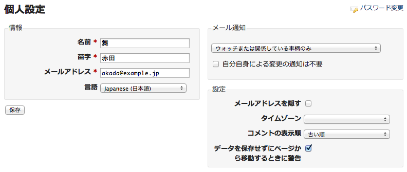

アカウント
==========

!!! note ""
    最終更新: 2017/09/11
    [[原文](http://www.redmine.org/projects/redmine/wiki/RedmineAccounts/6)]

[TOC]

マイアカウント
--------------

この画面では、自分のアカウント設定を編集することができます。編集できる項目は、姓、名、メールアドレスおよび言語です。

### メール通知

**メール通知** のチェックボックスにチェックを入れると、所属するプロジェクトでのイベント(チケットの追加・編集、新しい文書の追加)が行われるたびに、メールで通知されます。

チェックボックスがOFFの場合でも、自分が（作成者または担当者として）関係しているチケットおよびウォッチしている事項（チケットやフォーラム）に関しては、メールで通知されます。

### パスワード変更

パスワードを変更するには、現在のパスワードと、新しいパスワードを2回入力してください。パスワードの文字数は4文字以上12文字まででなければなりません。

ただし、アカウントが外部認証(LDAP)を使用している場合には、Redmineでパスワードを変更することはできません。

マイページ
----------

このページでは所属するプロジェクトに関する様々な情報をブロックで表示することができます。デフォルトの状態では、以下の2つの項目のみ表示されます。

-   担当しているチケット
    -   自分が所属しているすべてのプロジェクトで担当しているチケットのリストが表示されます。表示される項目は、チケットID、プロジェクト、トラッカー、題名です。題名の後に、チケットの現在のステータスがカッコで表示されます。

<!-- -->

-   報告したチケット
    -   自分が所属しているすべてのプロジェクトで報告したチケットのリストが表示されます。表示される項目は、チケットID、プロジェクト、トラッカー、題名です。題名の後に、チケットの現在のステータスがカッコで表示されます。

自分の好みに合わせて「マイページ」の表示を変更できます。「このページをパーソナライズする」をクリックしてください。表示されている情報のブロックごとに、表示/非表示が選択できます。
デフォルトの2項目以外に追加表示できるのは、以下のブロックです。

-   カレンダー
    -   自分が所属しているすべてのプロジェクトの週次カレンダーが概要表示されます。

<!-- -->

-   文書
    -   自分が所属しているすべてのプロジェクトの最新の文書が概要表示されます。

<!-- -->

-   最新ニュース
    -   自分が所属しているすべてのプロジェクトの最新のニュースが概要表示されます。

<!-- -->

-   作業時間
    -   自分が所属しているすべてのプロジェクトに要した直近7日間の作業工数が概要表示されます。

<!-- -->

-   ウォッチしているチケット
    -   自分が所属しているすべてのプロジェクトでウォッチしているチケットのリストが表示されます。表示される項目は、チケットID、プロジェクト、トラッカー、題名です。題名の後に、チケットの現在のステータスがカッコで表示されます。

ドラッグアンドドロップでも「マイページ」のレイアウト（ブロックの配置）変更や並び順の調整ができます。

パスワードを忘れたとき
----------------------

パスワードが分からなくなってしまったときは、[ログイン画面](RedmineLogin)で **パスワードの再発行** をクリックしてください。再発行画面でメールアドレスを入力するとメールが届きます。このメールには、パスワードのリセットを行うためのリンクが記載されています。

この機能はシステム管理者が無効にできますので注意してください（「[アプリケーションの設定](RedmineSettings#Lost-password)」参照）。また、外部認証(LDAP)を利用しているアカウントではこの機能は利用できません。

登録
----

登録をすれば、システム管理者の介在なしにアカウントを取得することができます。

ログイン画面で **登録** をクリックしてください。フォームの各項目を入力し送信してください。メールが届きます。メールに記載されたリンクを開き、アカウントを有効にします。

この機能はシステム管理者が無効にできますので注意してください。
