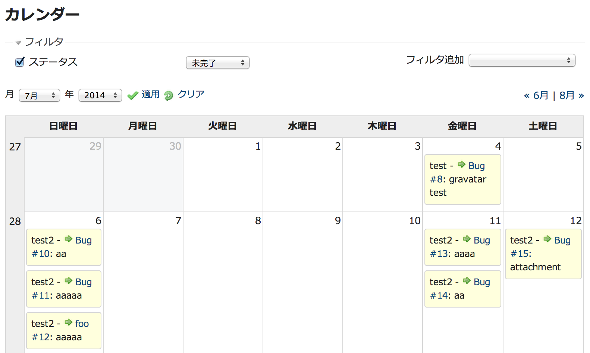

カレンダー
==========

!!! note ""
    最終更新: 2014/08/07
    [[原文](http://www.redmine.org/projects/redmine/wiki/RedmineCalendar/8)]

[TOC]

概要
----

現在のプロジェクトの概要が月ごとにカレンダー形式で表示されます。開始日が設定されているすべてのチケットについて開始日と (設定されていれば) 終了日が表示されます。
また、カレンダーには期日が設定されているすべてのバージョンが表示されます。

アクセス制御
------------

### モジュールの有効化

カレンダーの有効/無効はプロジェクトごとに「設定」画面で切り替えることができます。
「設定」画面で「モジュール」タブを開いて「カレンダー」のチェックボックスをON/OFFすることで有効/無効を切り替えることができます。

### ロールと権限

カレンダーへのアクセスはロールごとに許可または禁止することができます。
「管理」画面で「ロールと権限」を開き、ロールを選択して「カレンダーの閲覧」権限のチェックボックスをONまたはOFFにしてください。

フィルター
----------

[チケット](RedmineIssueList) や [ガントチャート](RedmineGantt) のように、フィルターを設定してカレンダー上に表示されるチケットを絞り込むすることができます。フィルタは [チケット](RedmineIssueList) のフィルタと同様のものです。

