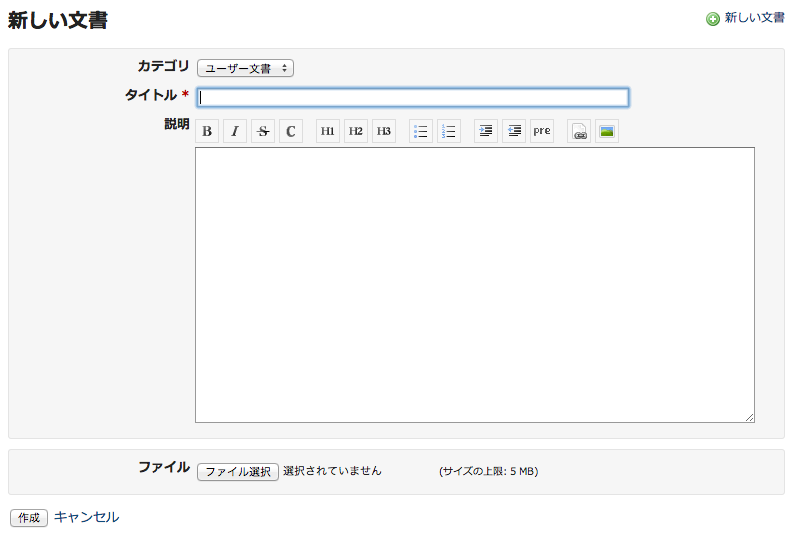
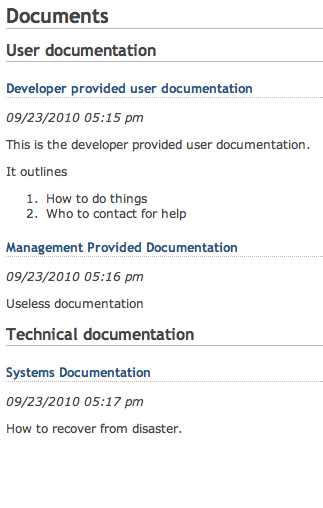

文書
====

!!! note ""
    最終更新: 2014/08/26
    [[原文](http://www.redmine.org/projects/redmine/wiki/RedmineDocuments/5)]

概要
----

「文書」は、Redmineのプロジェクトで利用できるモジュールの一つです。

文書の追加
----------

「文書」のタブで、  **新しい文書** のリンクをクリックしてください。

デフォルトでは、文書のカテゴリは2つあります。

1.  ユーザ文書
2.  技術文書

カテゴリの編集や他のカテゴリの追加は、Redmineの管理者が「<a href="/guide/RedmineEnumerations/">列挙項目</a>」画面の「文書カテゴリ」で行うことができます。

文書の閲覧
----------

一旦文書がアップロードされると、その題名はリンクとなり、添付文書のダウンロードや新しいファイルの追加ができます。

