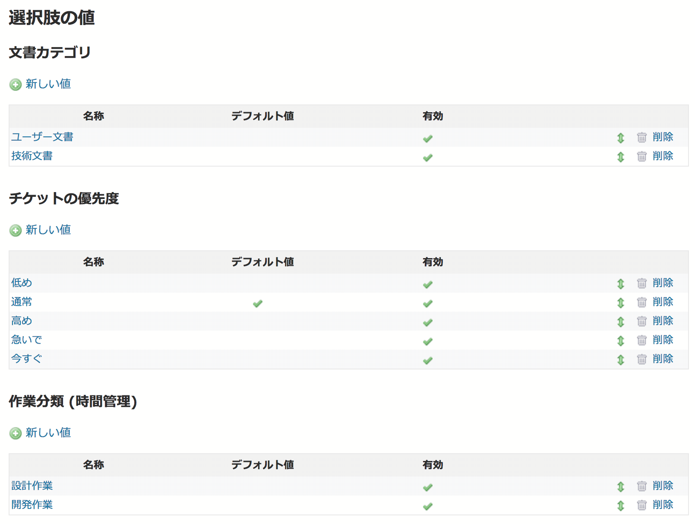

選択肢の値
========

!!! note ""
    最終更新: 2017/08/31 [[原文](http://www.redmine.org/projects/redmine/wiki/RedmineEnumerations/4)]

!!! note
    この画面の名称は以前は「列挙項目」でした。Redmine 3.4で「選択肢の値」に変更されました。

選択肢の値は以下の入力項目の選択肢として表示される値で、システム全体（すべてのプロジェクト）で共通です。

* 文書カテゴリ
* チケットの優先度 (低い優先度から高い優先度の順に並ぶ)
* 作業分類 (時間管理)

選択肢の値の値は自由に追加・削除・編集が行えます。それらの値のうち、どれをデフォルト値とするか指定するための設定があります。

「デフォルト値」チェックボックスをONにすると、入力項目が表示されるときにはその値がデフォルト値となります。もしデフォルト値として設定された値がない場合は、何も値が選択されていない状態で表示されます。

