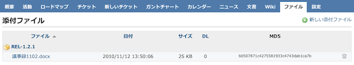
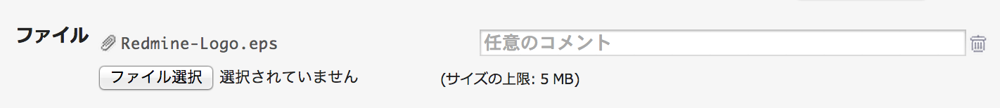

ファイル
========

!!! note ""
    最終更新: 2016/04/04
    [原文](http://www.redmine.org/projects/redmine/wiki/RedmineFiles/8)

各々のプロジェクトには「ファイル」モジュールがあり、「設定」画面から有効・無効を切り替えることができます。

Redmineにアップロードされた全ファイルの詳細がソート可能なテーブルに表示されます。ファイルのアップロードの際に特定の「バージョン」が選択されていた場合、ファイルはそのバージョンの下に表示されます。この画面で特徴的なのはMD5ハッシュ値とD/L(ダウンロード数)です。

新しいファイルを追加するには、画面左上の「新しい添付ファイル」をクリックしてください。

ファイルの保存領域
------------------

Redmineにアップロードされたファイルは、Redmineのインストールディレクトリの `files` ディレクトリに保存されています。

保存領域上のファイル名には一意のIDがプリフィックスとして追加されています。

新しいファイルのアップロード画面
--------------------------------

新しいファイルを追加するときには以下のような画面が表示されます。ファイルをバージョンに関連づける場合はリストボックス「バージョン」から特定のバージョンを選択してください。「別のファイルを追加」をクリックすると複数のファイルを同時に追加できます。

「任意のコメント」欄に入力したテキストは、ファイルへのリンクのalt属性に使われます（多くのブラウザではリンクテキストにカーソルをあてるとツールチップとして表示されます）。

