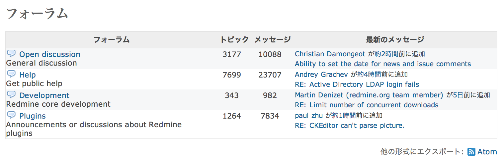

フォーラム
==========

!!! note ""
    最終更新: 2014/08/26
    [[原文](http://www.redmine.org/projects/redmine/wiki/RedmineForums/3)]

フォーラムは、プロジェクトごとにメンバー間のコミュニケーションが行える機能です。管理者はプロジェクトの「」画面でフォーラムの一覧を定義できます。

フォーラムの一覧には、プロジェクト内のフォーラムが概要表示されます。

-   トピック数の合計
-   メッセージ数の合計
-   最新メッセージへのリンク

トピックの追加
--------------

あるフォーラムにトピックを追加するには、フォーラム名をクリックし、続いて「新しいメッセージ」をクリックしてください。

メッセージの題名と本文の入力、ファイルの添付が可能になります。
2つのオプションが使用できます:

-   **スティッキー**: チェックボックスをONにすると、このトピックがリストのトップに太字で表示されます。
-   **ロック**: チェックボックスをONにすると、ユーザーはこのメッセージに返信を追加することができなくなります。
