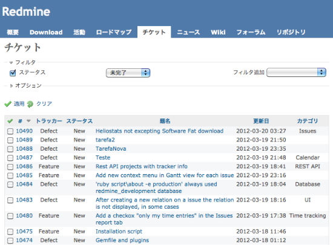
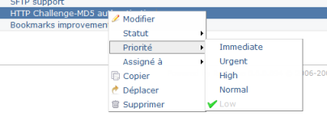
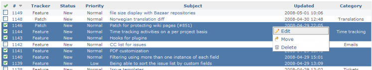

チケット一覧
============

!!! note ""
    最終更新: 2012/03/20

[TOC]

概要
----

チケット画面ではプロジェクト内の未完了のチケットが表示されます。

フィルタの適用と保存
--------------------

チケット一覧はデフォルトでは未完了のチケットを表示します。
標準のフィールドおよび [カスタムフィールド](RedmineCustomFields) がカスタムクエリを作成するのに利用できます。フィルタをセットしたら、「」をクリックするとチケット一覧を更新できます。「」をクリックするとフィルタを消去できます。

### カスタムクエリ {: #Custom-queries }

カスタムクエリは「」をクリックすることにより保存することができます。
「新しいクエリ」フォームで、クエリの名前およびチケット一覧で表示させたいカラムを指定してください(標準のフィールドおよび [カスタムフィールド](RedmineCustomFields) のいずれも表示させることができます). \*公開\*にチェックを入れるとこのクエリを全員が閲覧でき、チェックを入れなければ自分だけが閲覧できます。

クエリを保存すると、右側のサイドバーに一覧表示されます。

ショートカットメニュー
----------------------

チケット一覧の中のあるチケットを右クリック(Operaの場合はCtrl+左クリック)すると、コンテキストメニューが表示されます。
このメニューでは、編集、優先度の変更、担当者の変更、コピー、移動、削除などいくつかの機能へのショートカットが利用できます。

!!! note
    ショートカットメニューを表示させるには、*チケットへのリンク部分以外を右クリックしてください*。リンク部分を右クリックすると、ブラウザのコンテキストメニューが表示されます。

チケットの一括編集
------------------

チケット一覧で複数のチケットを選択してから右クリックすると、一括して編集・移動・削除を行うことができます。
チケットの選択は、チェックボックスをONにするか、Controlまたはシフトキーを押しながらクリックすることで行えます。また、チケット一覧の左上角のチェックマークをクリックすることにより、全てのチケットを選択できます。

