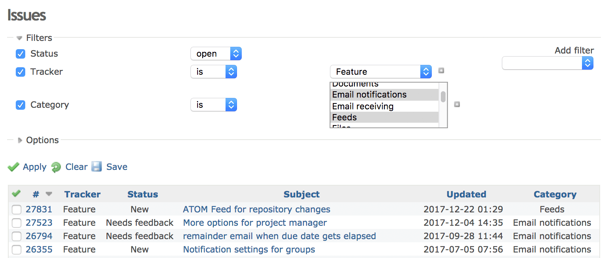
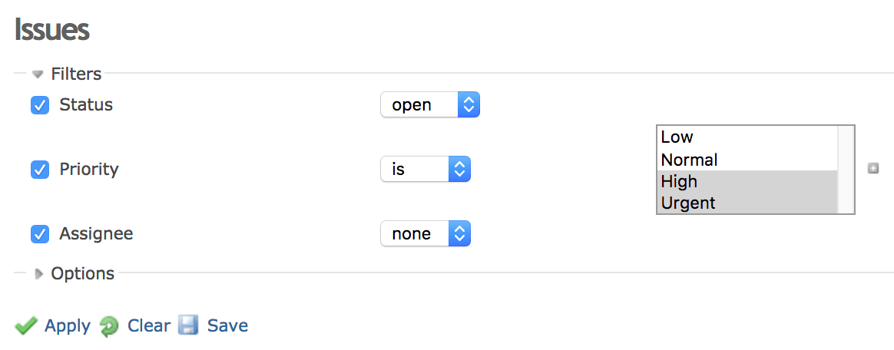
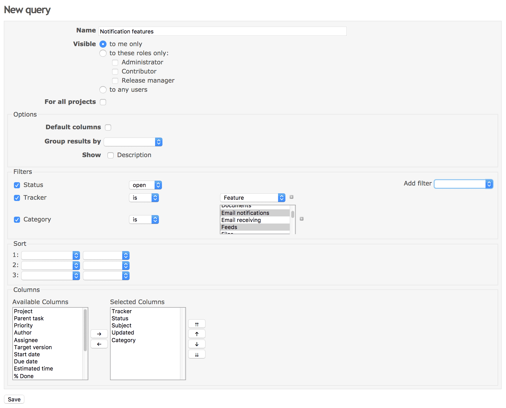
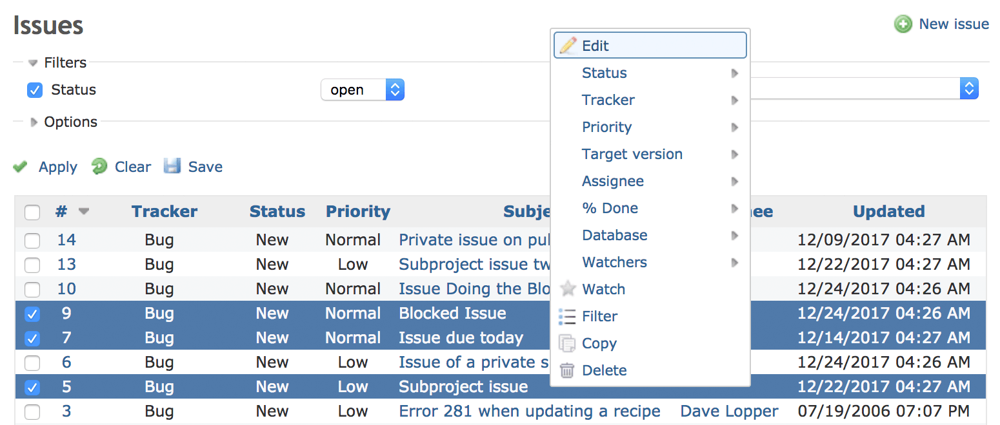

チケット一覧
============

!!! note ""
    最終更新: 2017/12/24
    [[原文](http://www.redmine.org/projects/redmine/wiki/RedmineIssueList/27)]
[TOC]

概要
----

チケット画面ではプロジェクト内のチケットを見ることができます。

フィルタの適用と保存
--------------------

チケット一覧はデフォルトでは未完了のチケットのみを表示します。一覧に表示するチケットの条件を変更するにはフィルタを使用します。フィルタとして利用できるのは標準フィールドおよび [カスタムフィールド](RedmineCustomFields) です。フィルタを設定し終えたら、「」をクリックするとチケット一覧を更新できます。また、「」をクリックするとフィルタを消去できます。

フィルタで複数の値を選択するにはドロップダウン横の「」ボタンをクリックします。これにより入力欄がドロップダウンからリストボックスに変化します。この状態で複数の値を選択するには、Ctrlキー（Windows）/ ⌘キー（macOS）を押しながらクリックしてください。

### カスタムクエリ {: #Custom-queries }

組み立てたフィルタはカスタムクエリとして保存できます。カスタムクエリとして保存したフィルタはクリック1つで適用することができます。

カスタムクエリは「」をクリックすることで保存できます。「新しいクエリ」フォームで、クエリの名前やチケット一覧で表示させたいカラムを指定してください（標準フィールドと [カスタムフィールド](RedmineCustomFields) のいずれも指定できます）。

保存したクエリは右側のサイドバーに一覧表示されます。

ショートカットメニュー
----------------------

チケット一覧の中のあるチケットを右クリック(Operaの場合はAlt+左クリック)すると、コンテキストメニューが表示されます。
このメニューでは、編集、優先度の変更、担当者の変更、コピー、移動、削除などいくつかの機能へのショートカットが利用できます。

!!! note
    ショートカットメニューを表示させるには、*チケットへのリンク部分以外を右クリックしてください*。リンク部分を右クリックすると、ブラウザのコンテキストメニューが表示されます。

チケットの一括編集
------------------

チケット一覧で複数のチケットを選択してから右クリックすると、一括して編集・移動・削除を行うことができます。
チケットの選択は、チェックボックスをONにするか、Ctrl（Windows） / ⌘（macOS）またはシフトキーを押しながらクリックすることで行えます。また、チケット一覧の左上角のチェックボックスをONにすると、全てのチケットを選択できます。

