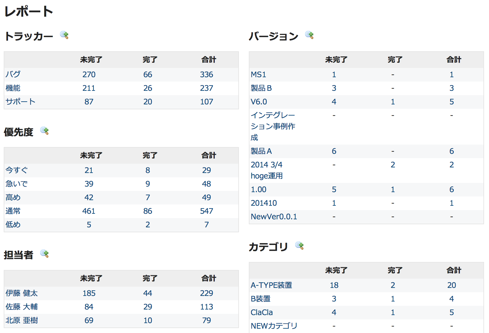
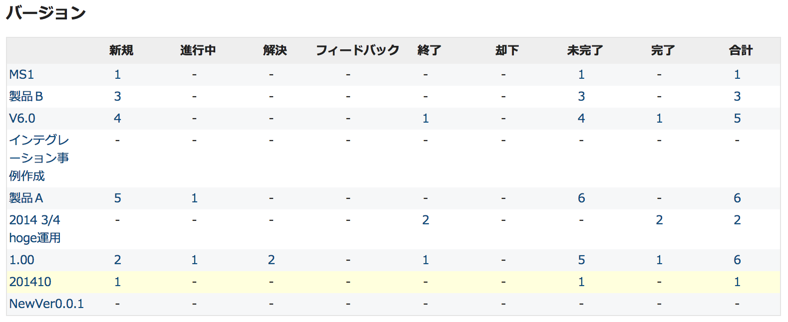

チケットのサマリー
==================

!!! note ""
    最終更新: 2014/08/19
    [[原文](http://www.redmine.org/projects/redmine/wiki/RedmineIssueSummary/3)]

[TOC]

概要
----

チケットのサマリーは、プロジェクト内の全チケットの集計レポートが表示される機能です(これに対し、バージョンの概要では、バージョン単位で概要表示されます)。このレポートは以下のような複数のブロックに分かれており、ブロックごとにチケットの未完了/完了/合計の数が表示されます:

-   トラッカー
-   優先度
-   チケットの担当者であるユーザー
-   チケットを作成したユーザー(作成者)
-   バージョン
-   カテゴリ

ドリルスルーリンク
------------------

レポート内のそれぞれのトラッカー、優先度、担当者、作成者、バージョン、カテゴリは [チケットの一覧](RedmineIssueList/) にリンクされていて、クリックされた項目のフィルタが設定された状態で開きます。また、レポート内のチケット数はドリルスルーリンクとなっていて、クリックすると [チケットの一覧](RedmineIssueList/) にそれらのチケットが表示されます。

詳細なレポート
--------------

レポートの各ブロックの、さらに詳細なレポートを取得できます。チケットの未完了/完了/合計の数が表示されるだけでなく、登録済みのすべてのチケットのステータスごとの数が表示されます。下の画像は、バージョンの詳細なレポートの例です。

