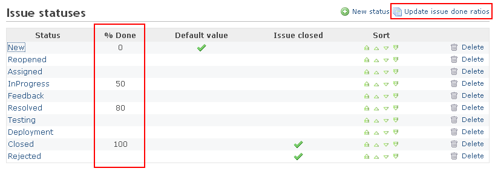
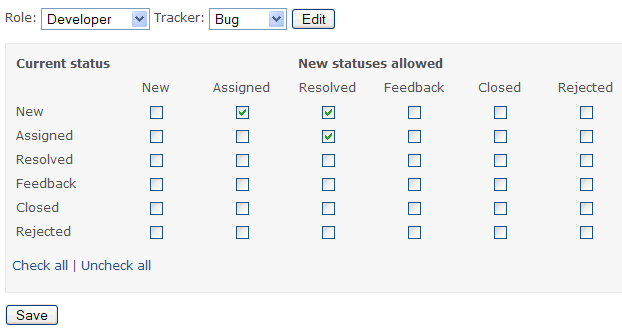
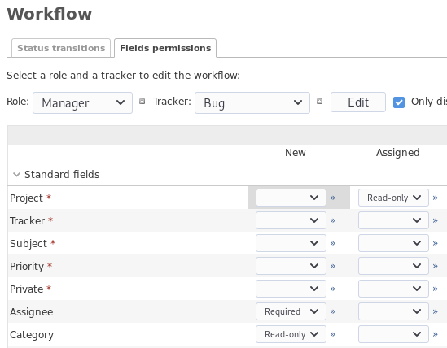

課題管理システム
================

!!! note ""
    最終更新: 2020/06/13 [[原文](https://www.redmine.org/projects/redmine/wiki/RedmineIssueTrackingSetup/41)]

[TOC]

トラッカー {: #Trackers }
----------

トラッカーはチケットの種別を定義します。よくあるトラッカーとしては、バグ、機能などが挙げられます。

トラッカーごとに以下のものを定義できます。

- 名称
- デフォルトステータス （新しいチケットに対してデフォルトで適用されるステータス）
- そのトラッカーのチケットを [ロードマップ](RedmineRoadmap.md) に表示するか
- ワークフロー
- そのトラッカーのチケットで使用できる標準フィールドとカスタムフィールド

新しいトラッカーを作成したら、そのトラッカーを利用するためにはワークフローの定義が必要です（トラッカー作成時に既存のトラッカーのワークフローをコピーすれば、ワークフローの定義を省略できます。「新しいトラッカーを作成」画面の「ワークフローをここからコピー」ドロップダウンリストでコピー元のトラッカーを選択してください）。

チケットのステータス
--------------------

チケットのステータスは自由に追加・削除できます。それぞれのステータスには以下の設定があります。

-   **終了したチケット**: そのステータスは、チケットが終了した状態であることを示します (複数のステータスを「終了したチケット」として定義できます)

### 進捗率

このオプション(およびチケットのステータス画面における一覧表内の列)は「管理」→「設定」→「チケットトラッキング」で [進捗の算出方法](RedmineSettings.md#Calculate-the-issue-done-ratio) が 「チケットのステータスを使用する」に設定されている場合に限り利用可能です。これにより、各チケットのステータスを手入力する代わりに、チケットのステータスに応じて自動的に進捗率を更新できるようになります。

この項目が空白の場合、チケットのステータスを変更しても進捗率は更新されません。

### 進捗の更新

このコマンドは [進捗の算出方法](RedmineSettings.md#Calculate-the-issue-done-ratio) が 「チケットのステータスを使用する」に設定されている場合に限り利用可能です。実行すると、すべてのチケットの進捗%の値がそのチケットのステータスに対応したものに更新されます。

ワークフロー
------------

ワークフローは、プロジェクトのメンバーに対してどのようにチケットのステータスを遷移することができるのかを定義するものです。

ワークフローの設定画面で、ワークフローを編集したいロールとトラッカーの組み合わせを選択し、「編集」ボタンをクリックしてください。選択したロールとトラッカーの組み合わせに対してどのようなステータス遷移を許可するのか設定できる画面が表示されます。「現在のステータス」は、ステータスの初期状態を示します。「ステータスの移行先」は、それぞれの初期状態から遷移できるステータスです。

!!! note
    ユーザーがチケットのステータスを更新するには「チケットの編集」権限が必要です。

上図の例では、ステータスが「New」である「Bug」トラッカーのチケットは、「Developer」ロールでは「Assigned」または「Resolved」に変更できます。ステータスが「Assigned」であるものは「Resolved」に変更できます。ステータスが「New」「Assigned」のいずれでもないものは、「Developer」ロールではステータスを変更することはできません。

フィールドに対する権限

このタブでは、フィールドに対して特別な権限をステータスごとに設定できます。設定できるのは「読み取り専用」または「必須」のいずれかです。いずれも指定しない場合はデフォルトの動作となります。

「読み取り専用」に設定すると、そのフィールドは編集画面に表示されず値の変更ができなくなります。「必須」に設定すると、編集時にフィールドを未入力のままにしておくことができなくなります。

