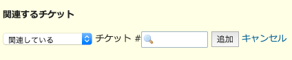
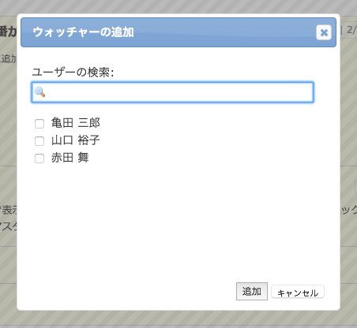
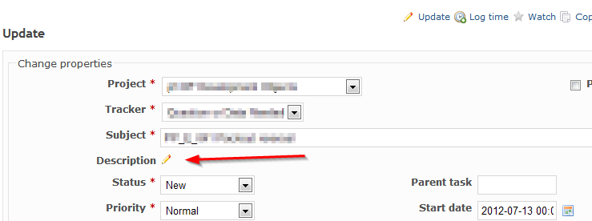

チケット
========

!!! note ""
    最終更新: 2016/04/03
    [[原文](http://www.redmine.org/projects/redmine/wiki/RedmineIssues/43)]

チケット管理はRedmineの中核をなす機能です。チケットはいずれかのプロジェクトに所属し、ある特定のユーザーが所有しています。そしてバージョンなどと関連づけることができます。

チケットの表示
--------------

チケットを表示すると、進行中の作業の状態を見ることができます。注記などの履歴は更新順に表示されます(表示順は「個人設定」画面で変更できます)。ほかのメンバーの注記の引用や、自分の注記の編集も行えます。

### 関連するチケット

「関連するチケット」を使うと、内容が重複するチケットを終了させたり作業の順序を明確にするためにチケット同士を結びつけることができます。

チケットの関連の種類にはさまざまなものがあります:

-   **関連している** - 単純にチケット同士を関連づけます。

<!-- -->

-   **次のチケットと重複** - 片方のチケットをクローズすると他方もクローズされるよう関連づけます
    例えば、チケットBからチケットAに対して「次のチケットと重複」が設定されている場合:
    - BをクローズしてもAのステータスはそのまま
    - AをクローズするとBも自動的にクローズされる

<!-- -->

-   **次のチケットが重複** - 「次のチケットと重複」の逆
    例えば、チケットAからチケットBに対して「次のチケットと重複」が設定されている場合:
    - BをクローズしてもAのステータスはそのまま
    - AをクローズするとBも自動的にクローズされる

<!-- -->

-   **ブロック先** - 片方のチケットがクローズされていない場合は他方もクローズできないようチケットを関連づけます
    もしチケットBの「ブロック先」がチケットAであれば、
    チケットAはチケットBをクローズしない限りクローズできません。
-   **ブロック元** - 「ブロック先」の逆

<!-- -->

-   **次のチケットに先行** - 作業順序を表現する関連です。チケットAはチケットBの開始日のX日前に完了しなければならないことを示します。
    チケットAからBに対して「次のチケットに先行」の関連づけが行われている場合、チケットBの開始日はチケットAの期日以前に設定することができません。
-   **次のチケットに後続** - 「次のチケットに先行」の逆
    チケットAからBに対して「次のチケットに後続」の関連づけが行われていて、チケットAの期日が4月21日でチケットBの開始日が4月22日の場合、チケットAの期日を2日後ろ倒しするとチケットBの開始日も2日後ろ倒しされます。

<!-- -->

-   **コピー元** - そのチケットをコピーして別のチケットを作ったときに自動的に設定されます。そのチケットがコピーされたことと、コピーにより作られたチケットがどれであるかを識別できます。
-   **コピー先** - 「コピー元」の逆

システム管理者はユーザーがチケットの関連づけを行えるかどうかの [権限](RedmineRoles) を設定できます。

### ウォッチャー

チケットのウォッチを行っているユーザーの一覧が表示されます。チケットが更新されるとこれらのユーザーに通知されます。

プロジェクトの管理者としてログインしている場合、ユーザーをウォッチャーの一覧に追加できます。追加ボタンを押すとウォッチャーを追加するためのダイアログボックスが表示されます。

システム管理者はユーザーがウォッチャーの追加/削除が行えるかどうか、ウォッチャーの一覧を参照できるかどうかの [権限](RedmineRoles) を設定できます。

### 関連するリビジョン

システム管理者が [参照用キーワード](RedmineSettings#Referencing-issues-in-commit-messages) を設定している場合、開発者がリポジトリへのコミットの際にそれらのキーワードをコミットメッセージに含めると、「関連するリビジョン」欄(通常は最初の履歴の右側)にコミットの一覧が表示されます。

リビジョンとチケットの関連づけは、リポジトリブラウザのリビジョン画面から手動で行うこともできます。手動での関連づけは、リビジョン画面で壊れた鎖のアイコンをクリックすることで解除することもできます。

新規チケットの登録
------------------

Redmineの管理者が [ロールと権限](RedmineRoles) の設定で権限を与えていれば、ユーザーはチケットを作成することができます(ロール画面の権限設定: チケットトラッキング &gt; チケットの追加)。
新しいチケットを作成する際、もっとも重要な項目は [トラッカー](RedmineIssueTrackingSetup#Trackers) で、これはチケットの種類を定義しています。デフォルトでは、Redmineは次の3つのトラッカーが組み込まれています: *バグ*, *機能*, *サポート*

既存チケットの更新
------------------

(TODO: describe and upload a screen-shot of update panel)

チケットを編集するには、 チケットの最上部か最下部の *編集* リンク(ペンのアイコン)をクリックしてください:

ユーザーのロールに付与されている権限 ([ロールと権限](RedmineRoles) を参照)によって編集可能な項目は異なります。

既存チケットの題名または説明の更新 {: #Updating-an-existing-issue }
----------------------------------

既存のチケットを編集するには、そのユーザーのロールに対して「チケットの編集」権限が [ロールと権限](RedmineRoles) の設定で付与されている必要があります。

1.  チケットを開く
2.  チケットの最上部か最下部の *編集* リンク(ペンのアイコン)をクリック

説明欄を更新するには、チケットの説明欄の横に表示さている鉛筆のアイコンをクリックしてください。

子チケット
----------

[チケットの編集](#Updating-an-existing-issue) を行うことで、「親チケット」フィールドの設定や削除ができます。これにより通常のチケットを子チケットにしたり、ある子チケットの親チケットを別のものに変更したり、子チケットを通常のチケットにすることができます。

-   子チケットは親チケットとは異なるプロジェクトに所属できます (管理画面の設定による)
-   親チケットに「次のチケットに先行」の関連が設定されている場合、子チケットの開始日・期日は自動的に再計算されます
-   親チケット
-   親チケットはチケットの一覧でソートやフィルタに使用できます
-   チケットの一覧が親チケットをキーにソートされているときやガントチャートでは、親子チケットの階層関係が表示されます
-   Descendant issues are displayed in a tree on the issue view with context menu support.
-   プロジェクトをコピーすると親子チケットの階層関係もコピーされます
-   親子チケットの階層数は無制限です
-   子チケットを作成するには「子チケットの管理」権限が必要です
-   親チケットの進捗率は子チケットの進捗率の加重平均です
-   親チケットの開始日は子チケットの開始日のうち最も早いものです
-   親チケットの期日は子チケットの期日のうち最も遅いものです
-   親チケットの作業時間は子チケットの作業時間の合計です
-   親チケットの予定工数は子チケットの予定工数の合計です
-   親チケットの優先度は子チケットの優先度のうち最も高いものです
