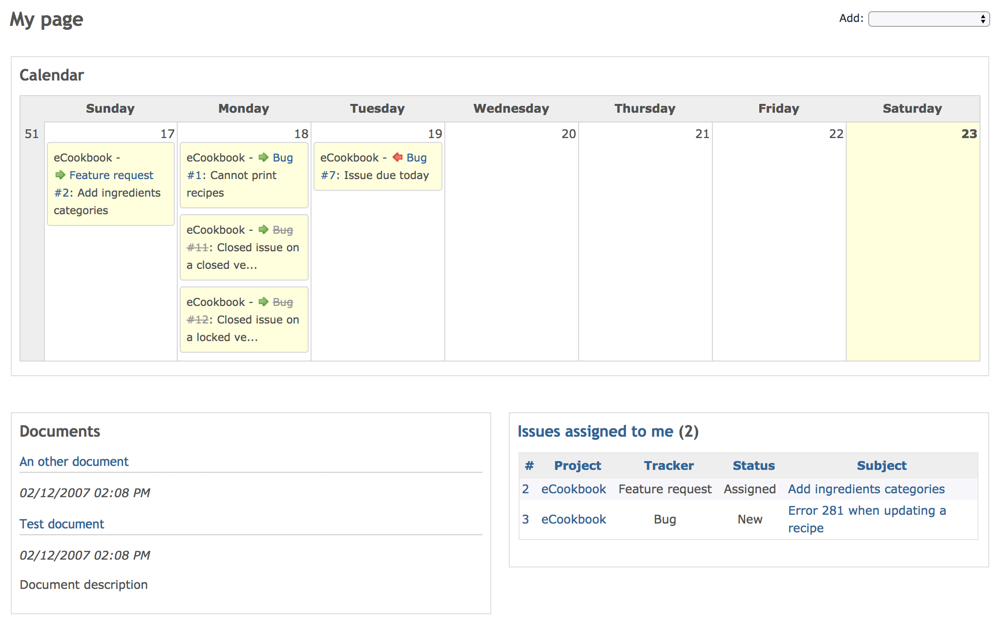

マイページ
==========

!!! note ""
    最終更新: 2017/12/24
    [[原文](http://www.redmine.org/projects/redmine/wiki/RedmineMyPage/4)]

[TOC]

マイページにはプロジェクトに関する様々な情報を表示することができます。

マイページブロック
------------------

デフォルトの状態では、以下の2つのブロックのみが表示されます。

-   担当しているチケット
    -   自分が所属しているすべてのプロジェクトで担当しているチケットのリストが表示されます。表示される項目は、チケットID、プロジェクト、トラッカー、題名です。題名の後に、チケットの現在のステータスがカッコで表示されます。

<!-- -->

-   報告したチケット
    -   自分が所属しているすべてのプロジェクトで報告したチケットのリストが表示されます。表示される項目は、チケットID、プロジェクト、トラッカー、題名です。題名の後に、チケットの現在のステータスがカッコで表示されます。

ブロックを追加したり削除したり並べ替えたりすることで、自分の好みに合わせて「マイページ」の表示を変更できます。デフォルトの2つのブロック以外に以下のものを追加できます。

-   カレンダー
    -   自分が所属しているすべてのプロジェクトの週次カレンダーが表示されます。

<!-- -->

-   文書
    -   自分が所属しているすべてのプロジェクトの最新の文書が表示されます。

<!-- -->

-   チケット
    -   選択したカスタムクエリによって抽出したチケットが表示されます。

<!-- -->

-   最新ニュース
    -   自分が所属しているすべてのプロジェクトの最新のニュースが表示されます。

<!-- -->

-   作業時間
    -   自分が所属しているすべてのプロジェクトに要した直近7日間の作業工数が表示されます。

<!-- -->

-   ウォッチしているチケット
    -   自分が所属しているすべてのプロジェクトでウォッチしているチケットのリストが表示されます。表示される項目は、チケットID、プロジェクト、トラッカー、題名です。題名の後に、チケットの現在のステータスがカッコで表示されます。

ドラッグアンドドロップにより「マイページ」のレイアウト（ブロックの配置）変更や並び順の調整ができます。
