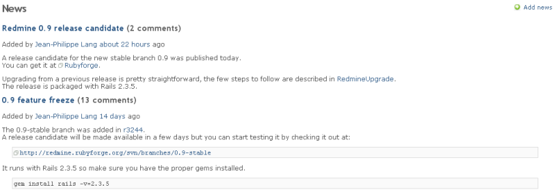

ニュース
========

!!! note ""
    最終更新: 2014/08/25
    [[原文](http://www.redmine.org/projects/redmine/wiki/RedmineNews/15)]

「ニュース」画面には、プロジェクトやそのほかの主題についてのニュースを掲載できます。

ニュースは、タイトル、サマリ、説明で構成されます。プロジェクトの「[概要](RedmineProjectOverview)」画面では「最新ニュース」としてサマリが表示され、ニュースのタイトルをクリックすると、説明が表示されます。

ユーザーに権限があれば、新しいニュースの作成や、既存のニュースへの追加/編集/削除が可能です（「[ロールと権限](RedmineRoles)」をご覧ください）。

新しいニュースを作成する権限があるユーザーには、画面右上に緑のプラスアイコン（「ニュースを追加」）が表示されます。これをクリックすると新しいニュースを追加できます。ニュースを追加するための画面が表示されるので、「タイトル」、「サマリ」、「説明」を入力してください。

