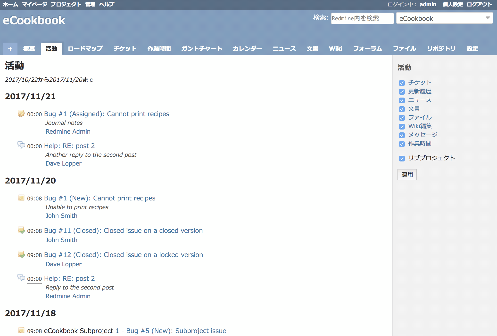

活動
====

!!! note ""
    最終更新: 2009/09/13
    [[原文](http://www.redmine.org/projects/redmine/wiki/RedmineProjectActivity/8)]

***活動*** 画面は、プロジェクトにおける全ての作業の時系列による記録を表示します。
次のものが含まれます。

-   チケットの登録や更新
-   リポジトリに対するチェックイン (チェンジセット)
-   ニュース

上記はデフォルトで表示されます。Wiki、フォーラムの更新情報を表示するよう設定することもできます。

-    チケットの新規登録
-    チケットの編集
-    チケットが完了した
-    チケットに注釈が追加された
-    リポジトリへのコミット
-    ニュースに新たな項目が追加された
-    フォーラムへのメッセージの追加または更新
-    フォーラムのメッセージにコメントを追加
-    Wikiへのページの追加または更新
-    「ファイル」に新たにファイルが追加された
-    「文書」への新たなファイルの追加または更新
-    プロジェクトの新規作成
