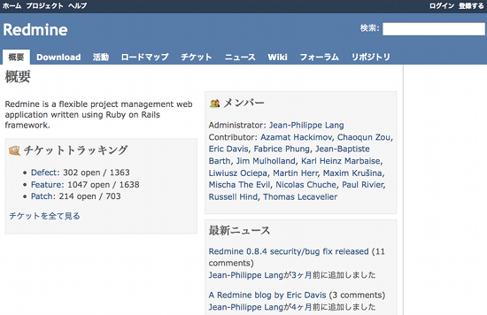

「概要」
=======

!!! note ""
    最終更新: 2009/09/13

「概要」画面はプロジェクト全体についての情報の要約を表示します。画面左上の ***チケットトラッキング*** ではトラッカーごとの完了していないチケット数、チケットの総数がわかります。 ***メンバー*** 領域では、そのプロジェクトに誰がメンバーとして所属しているのか、誰が管理者であるのかがわかります。 ***最新ニュース*** 領域ではプロジェクトの最新のニュースを確認できます。

画面右上には [「ログイン」](RedmineLogin) と [「登録」](RedmineRegister) というリンクがあります。 [「ログイン」](RedmineLogin) はプロジェクトを利用できるアカウントをもったユーザーがログインするのに使用します。 [「登録」](RedmineRegister) はシステム管理者が設定を行うと表示されます。
