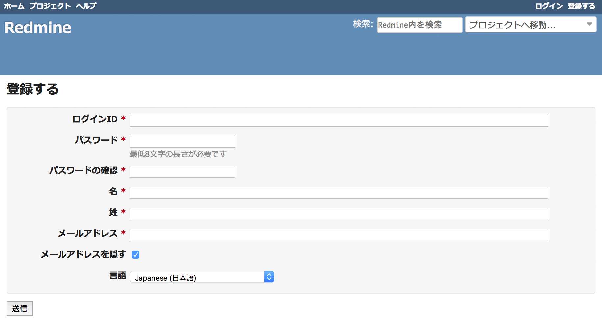

登録
====

!!! note ""
    最終更新: 2009/09/12
    [[原文](http://www.redmine.org/projects/redmine/wiki/RedmineRegister/3)]

「登録」画面では新しいユーザーの登録を行います。新しいユーザーの登録には、 A new user has to give the information about his ***ログイン***, ***パスワード***, ***名***, ***姓***, ***メールアドレス***, そしてユーザーインターフェイスで使用する言語の情報が必要です。

ログイン画面での「登録」リンクが表示されるか否かはシステム管理者の設定によります。

