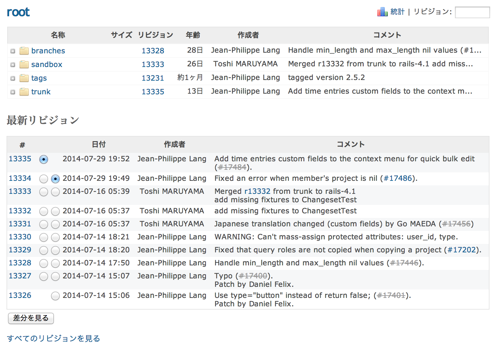

リポジトリ
==========

!!! note ""
    最終更新: 2014/08/11
    [[原文](http://www.redmine.org/projects/redmine/wiki/RedmineRepository/4)]

「リポジトリ」タブでは、プロジェクトのリポジトリを閲覧したり、最新のコミットを確認したりできます。

 をクリックすると、ディレクトリを展開できます。ディレクトリ名をクリックして、ディレクトリに移動することもできます。

リビジョン番号をクリックすると、コミットの詳細が表示されます。

特定のリビジョンでリポジトリを閲覧するには、画面右上のフィールドにリビジョン番号を入力し、Enterキーを押します。

