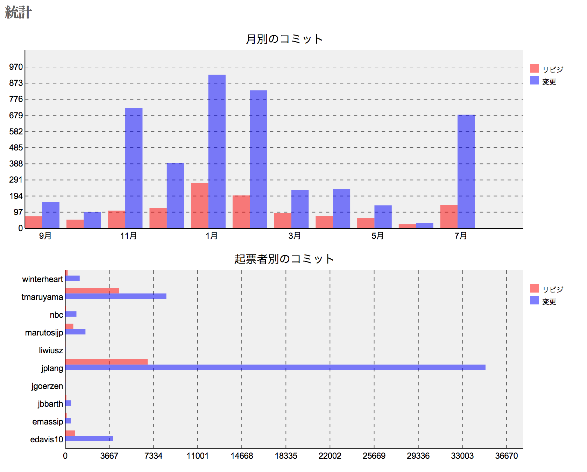

リポジトリの統計
================

!!! note ""
    最終更新: 2017/08/22
    [[原文](http://www.redmine.org/projects/redmine/wiki/RedmineRepositoryStatistics/5")]

Redmineは、プロジェクトに設定されたリポジトリ内での *変更* の数および *リビジョン* の数を示す二つのSVG画像を生成します。一つの画像は、変更の数とリビジョンの数の対比を月ごとに示すものです。もう一つは、変更の数とリビジョンの数をコミットを行った人ごとに示します。

定義
----

-   *リビジョン* は、リポジトリへのコミットの数で、赤系のオレンジで表示されます。
-   *変更* は、リポジトリ全体でこれまでに変更が加えられたファイルの数で、青で表示されます。

