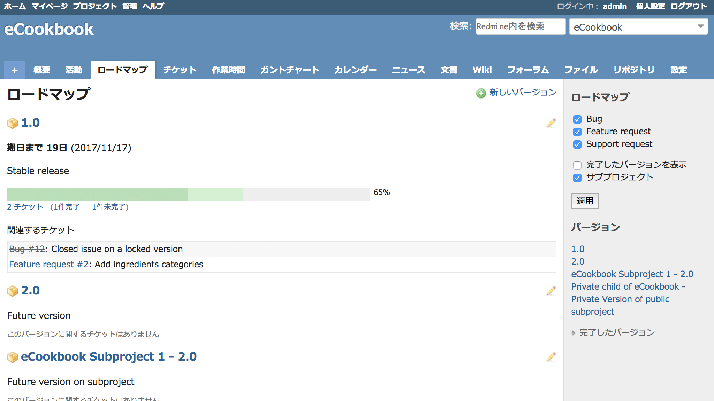

ロードマップ
============

!!! note ""
    最終更新: 2017/10/29
    [[原文](http://www.redmine.org/projects/redmine/wiki/RedmineRoadmap/19)]

[TOC]

ロードマップ画面は、プロジェクトの計画と管理に役立つチケットの情報をバージョンごとに表示します。また、プロジェクトの現在の状況をバージョンごとに詳しく表示します。

!!! note
    プロジェクトメニュー内の項目「ロードマップ」は、プロジェクトの設定でモジュール「[チケットトラッキング](RedmineProjectSettings#Core-modules)」が有効で、かつプロジェクトに1つ以上の[バージョン](RedmineProjectSettings#Versions)が作成されている場合にのみ表示されます。

概要
----

プロジェクトメニューから「ロードマップ」を選択すると、次の図のように、プロジェクトの現在の状態の概要が表示されます。

ロードマップ画面では、すべての（未完了の）バージョンについて、次の情報を確認できます:

-   バージョンの名称
-   バージョンの期日
-   進捗率のグラフ。バージョン全体の進捗率と、クローズされたチケットの進捗率が色分けして表示されます。進捗率野計算には各チケットの予定工数も加味されています。
-   バージョンに関連づけられたWikiページの内容 (後述）
-   バージョンに関連づけられたチケットの一覧（後述）

進捗率のグラフの下に表示されているチケット数はチケットの一覧画面にリンクしていて、クリックすると各バージョンの未完了/完了のチケットを簡単に表示できます。「XX件未完了」という表示をクリックするとすべての未完了のチケットの一覧が表示されます。完了したチケットの一覧を表示したいときは、「XX件完了」という表示をクリックしてください。

バージョンの名称（ の右側）をクリックすると、そのバージョンの詳細が表示されます（[詳細](RedmineVersion)）。

### バージョンの進捗率

グラフの右側に表示されるバージョンの進捗率の計算においては、各チケットの重み付けに予定工数が使われています。予定工数が入力されていないチケットに対しては予定工数の平均値が使われます。どのチケットにも予定工数が入力されていない場合、すべてのチケットが同じ重みとして扱われます。

詳細: [#2182#note-6](http://www.redmine.org/issues/2182#note-6)

ロードマップの管理操作
----------------------

適切な権限が付与されていれば、以下の2つの方法でロードマップの表示を変更できます:

1. バージョンに対してWikiページを関連づけることができます（[プロジェクトの設定 → バージョン](RedmineProjectSettings#Versions)を参照）。そのバージョンの目的などを記述できます。
2. バージョンの「関連するチケット」の一覧にどのトラッカーのチケットを表示するのか選択できます。この設定は、システム管理者が「管理」→「トラッカー」画面（[詳細](RedmineIssueTrackingSetup#Trackers)）のトラッカーの編集画面で行えます。

サイドバー
----------

ロードマップ画面右側のサイドバーには以下のものが表示されます:

-   完了したバージョンを表示させるためのチェックボックス
-   ロードマップに表示するトラッカーを選択するためのチェックボックス（どのトラッカーにデフォルトでONになっているかは、個々の[トラッカーの設定](RedmineIssueTrackingSetup#Trackers)によります）
-   そのプロジェクトで構成済みのバージョンへのリンク
