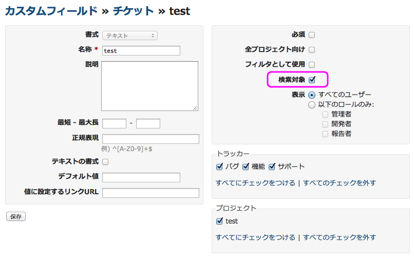

検索
====

!!! note ""
    最終更新: 2015/04/19
    [[原文](http://www.redmine.org/projects/redmine/wiki/RedmineSearch/5)]

検索ボックス
------------

Redmineの画面右上に検索ボックスがあります。キーワードを入力してEnterキーを押すと検索が行えます。

検索キーワードにチケットの番号(例: \#999 または 999)を指定すると、そのチケットの画面に遷移します。検索キーワードはダブルクォーテーションで囲むこともできます。

ドロップダウンメニューには現在のプロジェクトが表示されます。検索機能では、現在のプロジェクトの情報の全文検索を行います。

検索ボックス左側の **検索** をクリックすると、詳細検索画面に移動します。この画面には、検索対象のプロジェクトを選択のためのドロップダウンメニューと、検索対象の情報を選択するためのチェックボックスがあります。チェックボックスは、そのプロジェクトで有効にしているモジュールについてのみ表示されます。

検索の設定
----------

### タイトルのみ

詳細検索画面で **タイトルのみ** を有効にすると検索結果を限定することができます。

### カスタムフィールドの検索

カスタムフィールドを検索対象に含めたい場合は、カスタムフィールドの設定画面で **検索対象** のチェックボックスを有効にしてください。

<!--

h2. 検索結果

Here is a sample results page from this site on "test issue".

* Many links to go to what was found.
* Unique text highlighting by search terms.
* Capability to jump to groupings of results (ie News items).
* Leading icons to categorize type of result (ie changeset, issue, comment)

!Results.png!

-->

Search controller
-----------------

検査機能の動作の詳細を把握するには、以下のソースコードを見てください。

[trunk/app/controllers/search_controller.rb](http://www.redmine.org/projects/redmine/repository/entry/trunk/app/controllers/search_controller.rb)

ソースコードを確認すると次のような検索機能の挙動も把握できますす。

-   検索には最初の5個までのキーワードが使われます。
-   キーワードは2文字以上である必要があります。
-   検索結果は10件ごとにページを分けて表示されます。
