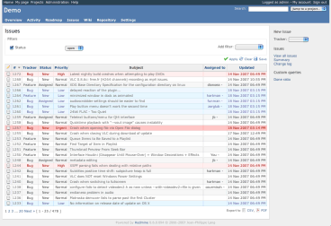

アプリケーションの設定
======================

!!! note ""
    最終更新: 2013/03/25

[TOC]

全般
----

### アプリケーションのタイトル

Redmineの画面の上部に表示あれるタイトルです。

### ウェルカムメッセージ

アプリケーションの「ホーム」ページに表示されるテキストです。HTMLタグを利用することもできます。

### ページ毎の表示件数

チケットなどのオブジェクトを1ページに何件表示するのか、ユーザーが選択可能な固定値を定義します。

*デフォルト: 25, 50, 100*

### ページごとの検索結果表示件数

検索結果を1ページあたり何件表示するのか指定します。

*デフォルト: 20*

### プロジェクトの活動ページに表示される日数

活動画面で1画面に何日分の情報を表示するのか指定します。

### ホスト名

Redmineのホスト名。ユーザーに送信されるメール中のURLで使用されます。

### プロトコル

メール通知でリンクを生成する際に使用されます。 *デフォルト: http*

### テキスト書式

チケット、ニュース、ドキュメントなどでテキスト部分でどのような記法を使うかを設定します。

**Textile** *(デフォルト)* または **Markdown** を選択できます。

### テキスト書式の変換結果をキャッシュ

TextileやMarkdownなどのWiki記法からHTMLへの変換はブラウザにページを送信するたびに行われます(例: チケットの説明、Wikiページなど)。この処理は大きなテキストだと時間がかかることがあります。

この設定を有効にすると、変換済みのHTMLをキャッシュすることができます。キャッシュは `config.action_controller.cache_store` で指定したキャッシュストアに保持されます。デフォルトではMemoryStoreが使われます。

キャッシュを有効にしたときのメモリの消費量が気になる場合、MemCacheStoreやFileStoreなど別の種類のキャッシュストアを利用することを強く推奨します。

キャッシュストアのより詳しい解説はRails Guidesをご覧ください: <http://guides.rubyonrails.org/caching_with_rails.html#cache-stores>

### Wiki履歴を圧縮する

wiki履歴の圧縮を有効にします（データベース領域を節約します） *デフォルト: なし*

### Atomフィードの最大出力件数

RSSフィードで出力するエントリ数の上限です *デフォルト: 15*

表示
----

### テーマ

カスタムテーマを選択することができます。
Redmineには、 [デフォルトのテーマ](http://www.redmine.org/projects/redmine/wiki/ThemeDefault) のほかに2個のテーマが同梱されています。

-   [alternate](http://www.redmine.org/projects/redmine/wiki/ThemeAlternate) : チケットの一覧を優先度に応じて色分け表示します
-   [classic](http://www.redmine.org/projects/redmine/wiki/ThemeClassic) : Redmine 0.5.1で使われていた旧形式のテーマです

alternateテーマの画面:



テーマは `public/themes/` に格納されています。テーマについての詳細は [テーマ](HowTo_create_a_custom_Redmine_theme.md) を参照してください。

### デフォルトの言語

既定の言語は、利用者のブラウザの言語をアプリケーションが識別できないときに利用されます。また、複数の利用者（異なる言語が混在）へメールを送信する際にも利用されます。 *デフォルト: English*

### 匿名ユーザーにデフォルトの言語を強制

(WIP)

### ログインユーザーにデフォルトの言語を強制

(WIP)

### 週の開始曜日

(WIP)

### 日付の形式

日付をどのような形式で表示するか選択できます:

* **ユーザーの言語の設定に従う**: ユーザーが設定している言語に従った形式で表示されます。
* **他の形式**: 常に指定された形式で表示されます。

*デフォルト: ユーザーの言語の設定に従う*

### 時刻の形式

日付をどのような形式で表示するか選択できます:

* **ユーザーの言語の設定に従う**: ユーザーが設定している言語に従った形式で表示されます。
* **他の形式**: 常に指定された形式で表示されます。

*デフォルト: ユーザーの言語の設定に従う*

### 時間の形式

時間（予定工数、作業時間など）をどのような形式で表示するか選択できます:

* **0.75** _(デフォルト)_ : 小数で表示します。
* **0:45 h** : "HH:MM" 形式で表示します。

### ユーザー名の表示形式

氏名をどのような形式で表示するのか指定します。以下の組み合わせが選択できます。

-   名
-   名 姓
-   姓 名
-   姓, 名
-   ユーザー名

### Gravatarのアイコンを使用する

有効にすると、ユーザーの[Gravatar](http://en.gravatar.com/) (globally recognized avatar) が様々な箇所で表示されるようになります。

### デフォルトのGravatarアイコン

Gravatarアイコンを持っていないユーザーに対して表示するアイコンを設定します。

### 添付ファイルのサムネイル画像を表示 {: #Display-attachment-thumbnails }

有効にすると、添付画像のサムネイルが添付ファイルの一覧の下に表示されます。

### サムネイル画像の大きさ

[添付ファイルのサムネイル画像を表示](#Display-attachment-thumbnails) がONのとき、サムネイル画像のサイズをピクセル単位で指定します。

_デフォルト: 100_

### 新規オブジェクト作成タブ

(WIP)

認証
----

### 認証が必要

このオプションが有効な場合、未認証のユーザーはどのページにもアクセスできません。Redmineにアクセスするためには必ずログインする必要があります。 *デフォルト: 無効*

### 自動ログイン

ユーザーが自動ログインを利用できるようになります。 *デフォルト: 無効*

### ユーザーによるアカウント登録 {: #Self-registration }

新規ユーザーが自分自身でユーザー登録を行う機能の有効／無効を切り替えます。

-   **無効**: 登録は行えません
-   **メールでアカウントを有効化**: 新規ユーザーにはアカウントを有効にするためのリンクが記載されたメールが届きます (ユーザーは正しいメールアドレスを入力する必要がある)。
-   **手動でアカウントを有効化** (デフォルト): 新規ユーザーのアカウントは作成されますが、システム管理者の承認が必要です。管理者には承認待ちのアカウントがある旨のメールが届きます。
-   **自動でアカウントを有効化**: 新規ユーザーは登録が完了すると直ちにログインすることができます。

### アカウント登録画面でカスタムフィールドを表示

(WIP)

### ユーザーによるアカウント削除を許可

(WIP)

### パスワードの最低必要文字数 {: #Minimum-password-length }

パスワードの最低文字数を設定できます。

*デフォルト: 8*

### パスワードの有効期限

(WIP)

### パスワードの再発行 {: #Lost-password }

[パスワード再発行機能](RedmineAccounts#Password-lost)が有効になります。 *デフォルト: 有効*

### OpenIDによるログインと登録 {: #Allow-OpenID-login-and-registration }

OpenIDによるログインと登録の有効・無効を切り替えます。この機能は、必要なライブラリ（ruby-openid gem）がインストールされていない場合は常に無効になっています。

### セッション有効期間

API
---

### RESTによるWebサービスを有効にする

### JSONPを有効にする

プロジェクト
------------

### デフォルトで新しいプロジェクトは公開にする

### 新規プロジェクトにおいてデフォルトで有効になるモジュール

### 新規プロジェクトにおいてデフォルトで有効になるトラッカー

### プロジェクト識別子を連番で生成する

### システム管理者以外のユーザーが作成したプロジェクトに設定するロール

チケットトラッキング
--------------------

### 異なるプロジェクトのチケット間で関係の設定を許可

有効にすると、異なるプロジェクトのチケット間で関係の設定ができるようになります。 *Default: 無効*

### チケットをコピーしたときに関連を設定

### 異なるプロジェクトのチケット間の親子関係を許可

### 重複しているチケットを連動して終了

### グループへのチケット割り当てを許可

### 現在の日付を新しいチケットの開始日とする

### サブプロジェクトのチケットをメインプロジェクトに表示する

有効にすると、チケット一覧、カレンダー、ガントチャートにサブプロジェクトのチケットも表示されるようになります。 *Default: 有効*

### 進捗率の算出方法 {: #Calculate-the-issue-done-ratio }

チケットの 進捗% の設定方法です。

-   チケットのフィールドを使用する (デフォルト): Users can manually set % done.
-   チケットのステータスを使用する: 各々のステータスにあらかじめ割り当てられた進捗率をチケットの進捗率とすることができます。

### 休業日

### エクスポートするチケット数の上限

チケットをCSV、PDF形式でエクスポートする際の最大数。 *デフォルト: 500*

### ガントチャートの最大表示件数

### チケットの一覧で表示する項目

この設定により、チケット一覧でどの項目を表示させるのか指定できます。この画面では「全プロジェクト向け」と設定されているカスタムフィールドのみが選択できます。

時間管理
--------

### 作業時間の必須入力フィールド

### 1日・1人あたりの作業時間の上限

### 作業時間に0時間の入力を許可

ファイル
--------

### 添付ファイルサイズの上限

アップロードできるファイルの最大サイズです(KB)。 *デフォルト: 5120 (5MB)*

### 許可する拡張子

### 禁止する拡張子

### 画面表示するテキストファイルサイズの上限

テキストファイルをインライン表示する際のファイルサイズの上限を指定します。

### 差分の表示行数の上限

diffの結果を画面表示する際の最大行数を指定します。

### 添付ファイルとリポジトリのエンコーディング

リポジトリに格納されたファイルにどのようなエンコーディングを適用するのか指定します。(コンマで区切ることにより複数の値を指定できます)。これらのエンコーディングはファイルの内容や差分をブラウザで表示する際に文字化けが発生しないよう、UTF-8に変換する際に使用されます。
複数の値を設定した場合、ファイルの内容に対して有効な最初のエンコーディングが使用されます。

フランス語の場合の設定例:

``` text
UTF-8, ISO 8859-15, CP1252
```

日本語の場合:

``` text
UTF-8, CP932, EUC-JP
```

メール通知
----------

### 送信元メールアドレス

ユーザーにメールを送信する際に使用されるFromアドレスです。

### ブラインドカーボンコピーで受信(bcc)

メール通知がBccで送信されるようになります。 *Default: 有効*

### プレインテキストのみ(HTMLなし)

メールがHTMLではなくプレインテキストのみで送信されるようになります。

### デフォルトのメール通知オプション

### メールのヘッダ

### メールのフッタ

Redmineから送信されるメールの末尾に付加するテキストを指定できます。

リポジトリ
----------

### 使用するバージョン管理システム

### コミットを自動取得する

このオプションが有効である場合、ユーザーが「リポジトリ」を参照した際に自動的に新しいリビジョンを取得します。

*デフォルト: 有効*

このオプションを無効にし、Repository\#fetch\_changesetsの呼び出しを自動化することにより、全リポジトリの全リビジョンをバックグラウンドで取得させることができます。
例:

``` sh
ruby script/runner "Repository.fetch_changesets" -e production
```

この処理をpost-commitまたはpost-receiveフックを利用してリポジトリから呼び出すこともできます。これにより新しいリビジョンがコミットごとに自動取得されるようになります。

gitによるpost-commit/post-receiveフックの設定例: <http://finalcog.com/remine-git-post-receive>

### リポジトリ管理用のWeb Serviceを有効にする

このオプションは、SVNリポジトリの作成を自動化するスクリプトをインストールしている時のみ有効にします。 *デフォルト: 無効*

### ファイルのリビジョン表示数の上限

### コミットメッセージにテキスト書式を適用

### コミットメッセージ内でチケットの参照/修正 {: #Referencing-issues-in-commit-messages}

コミットメッセージがリポジトリから取得されると、参照する、もしくは修正されたチケットのIDが検索されます。
このオプションは、コミットメッセージから参照先あるいは修正されたチケットを自動的に検出するためのキーワードをを定義できます。また、修正されたチケットについてRedmineのステータスをどのように変更するのか設定できます。

デフォルトのキーワード:

-   参照するチケット: refs, references, IssueID
-   修正されたチケット: fixes, closes

修正されたチケットで、ステータスのデフォルト値は設定されていません。コミットと同時にチケットをクローズさせるためには、ステータスを設定してください。
もしキーワードを使わずにチケットを参照させたい場合、単にアスタリスク: \* を **参照用キーワード** に入力してください。メッセージ中に検出されたチケットIDはすべてチェンジセットに関連づけられます。

デフォルトのキーワードを使ったコミットの例:

``` text
This commit refs #1, #2 and fixes #3
```

このメッセージはチケット1および2を参照し、チケット3のステータスを自動的に変更します。
キーワードの後のチケットIDは、スペース、コンマもしくはアンパサンド(&)で区切ることができます。

### コミット時に作業時間を記録する

### 作業時間の作業分類
