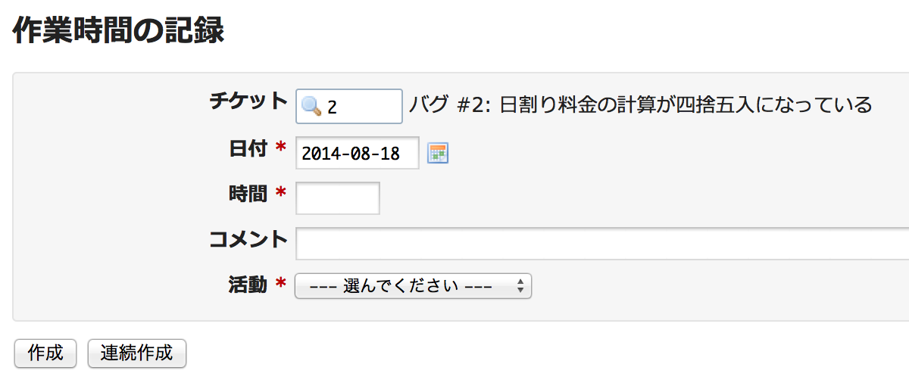
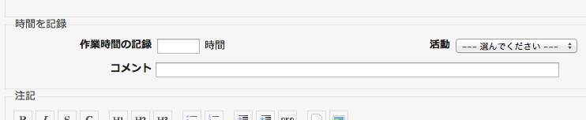

時間管理
========

!!! note ""
    最終更新: 2016/04/03
    [[原文](http://www.redmine.org/projects/redmine/wiki/RedmineTimeTracking/14)]

概要
----

時間管理(作業時間の記録)機能を使って、特定のチケットまたはプロジェクトに対して、どれくらいの工数をかけたのか記録し、その時間の集計をすることができます。「作業時間の記録」を入力すると、その作業がどのような活動なのか「作業分類」により分類が可能になるほか、作業に対するコメントも付けることができます。予定工数を入力することにより、プロジェクトマネージャーは、プロジェクトの見積もりに改良を加えたり、各ユーザーの進捗をフォローしたりすることができます。

作業時間の記録にはユーザー名も登録されるので、その該当ユーザーの工数のうち、請求可能な時間を計上することもできます。詳しくは、 [作業時間の記録: 詳細](RedmineTimelogDetails) または [作業時間の記録: レポート](RedmineTimelogReport) をご覧ください。

インストールと環境設定
----------------------

「時間管理」は、Redmineの標準モジュールの一つであり、新規プロジェクトのフォームでは **モジュール** のセクションで、既存のプロジェクトでは **設定** タブで、プロジェクトごとに有効または無効にすることができます。

チケットへの作業時間の登録
--------------------------

チケットの詳細を表示した画面で  **時間を記録** をクリックして、作業時間を入力できます。



また、チケットの更新時に作業時間を記録することもできます。



プロジェクトへの作業時間の登録
------------------------------

チケット番号の入力欄を空にすると、プロジェクトに対して工数入力ができます。

時間の入力で使える単位
----------------------

予定工数や作業時間は次のような形式で入力できます:

-   標準的な時間と分の入力形式: `1h`, `1 h`, `1 hour`, `2 hours`, `30m`, `30min`, `1h30`, `1h30m`, `1:30`
-   十進化時間での時間と分の入力形式: `1.5`, `1,5` (どちらも `1h30` と入力するのと同じです)

### 十進化時間について

Redmine上で予定工数や作業時間の入力を [十進化時間](http://ja.wikipedia.org/wiki/%E5%8D%81%E9%80%B2%E5%8C%96%E6%99%82%E9%96%93) で行う場合は、次のことに注意してください

-   例: 4つのチケットに対して、作業時間をそれぞれ1.00、 0.10、 0.15、 0.40と入力したとします。[作業時間の記録: レポート](RedmineTimelogReport) を表示して結果を確認してみましょう(「概要」画面の右サイドバー → 作業時間の記録 → 「詳細 | レポート」)。作業時間の合計は2時間5分と表示されると思うかもしれませんが、実際には 1.65時間と表示されています。
-   *説明*: この「挙動」は正常な想定通りのものでありバグではありません。十進化時間でこの4つの作業時間の入力を集計したため、この結果になるのです。標準の時間と十進化時間の関係は次のようになります:
    -   十進化で 1.00 は 60分 (1 時間)
    -   十進化で 0.10 は 6分
    -   十進化で 0.15 は 9分
    -   十進化で 1.65 は 24分
    -   十進化で 1.65 は 24分
    -   2時間5分 (125分) は 十進化では 約2.0833333333333335時間

Redmine上では少数第3位で四捨五入をするため、(上記の最後の例で分かるように)十進化時間とはごくわずかな誤差が生じることがあります。

以下のサイトも参照してください。

-   <http://ja.wikipedia.org/wiki/%E5%8D%81%E9%80%B2%E5%8C%96%E6%99%82%E9%96%93>
-   <http://www.springfrog.com/converter/decimal-time.htm>

コミットメッセージ経由での作業時間の登録
----------------------------------------

「設定」→「リポジトリ」画面で **「コミット時に作業時間を記録する」** にチェックを入れると、次のような形式でコミットメッセージに作業時間を入力して、チケットに作業時間を記録することができます（先にチケットIDを書いてから時間を書いてください）:

``` text
Fixed something, #435 @1h30
```

このコミットメッセージで、\#435のチケットに1時間30分の作業時間が記録されます。

不具合が発生する場合は、「設定」→「リポジトリ」画面で、「作業時間の作業分類」の項目が「既定」以外になっていることを確認してください。そして、以下のような書式でコミットメッセージを入力してください。

``` text
refs #435 @1h30
```
