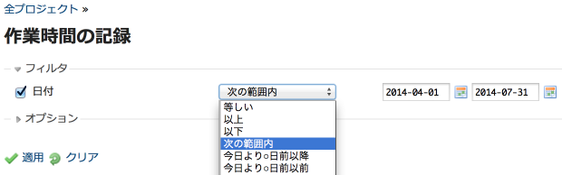
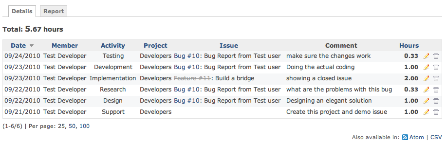

作業時間の記録: 詳細
====================

!!! note ""
    最終更新: 2014/08/18
    [[原文](http://www.redmine.org/projects/redmine/wiki/RedmineTimelogDetails/7)]

[TOC]

概要
----

Redmine上で継続的に工数の入力をすると、作業時間記録の **詳細** でプロジェクトごとに要した作業時間の合計を見ることができます。

検索
----

[作業時間の記録: レポート](RedmineTimelogReport) と同じ検索画面を使用します。

結果の出力
----------

デフォルトでは、作業時間の記録の詳細として、システムに登録された「全期間」の結果が表示されます。

下記画像の上から順に以下のような構成になっています。

-   検索結果の時間の合計
-   作業時間の一覧(ページネートされたもの)
    -   ソート可能な列
-   Atom フォーマットおよびCSV でのエクスポート用ボタン

最後の行はチケットが表示されていないことに注意してください。作業時間がプロジェクトに対して記録されているためです。

リンクは、wikiと同様に動作します。終了したチケットには、取り消し線が引かれます。

### HTML

### CSV

上記と同じ工数入力結果をCSV 出力すると、下記のようなサンプルとなります:

| Date       | User           | Activity       | Project    | Issue | Tracker | Subject                   | Hours    | Comment                             |
|------------|----------------|----------------|------------|-------|---------|---------------------------|----------|-------------------------------------|
| 09/24/2010 | Test Developer | Testing        | Developers | 10    | Bug     | Bug Report from Test user | 0.333333 | make sure the changes work          |
| 09/23/2010 | Test Developer | Development    | Developers | 10    | Bug     | Bug Report from Test user | 1.0      | Doing the actual coding             |
| 09/23/2010 | Test Developer | Implementation | Developers | 11    | Feature | Build a bridge            | 2.0      | showing a closed issue              |
| 09/22/2010 | Test Developer | Research       | Developers | 10    | Bug     | Bug Report from Test user | 0.333333 | what are the problems with this bug |
| 09/22/2010 | Test Developer | Design         | Developers | 10    | Bug     | Bug Report from Test user | 1.0      | Designing an elegant solution       |
| 09/21/2010 | Test Developer | Support        | Developers |       |         |                           | 1.0      | Create this project and demo issue  |
