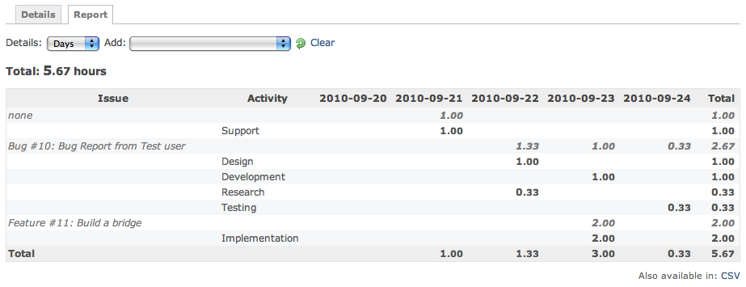

作業時間の記録: レポート
========================

!!! note ""
    最終更新: 2014/08/18
    [[原文](http://www.redmine.org/projects/redmine/wiki/RedmineTimelogReport/6)]

[TOC]

概要
----

入力した工数は [作業時間の記録: 詳細](RedmineTimelogDetails) で確認できますが、レポート形式で集計した結果を見ることもできます。
「作業時間の記録」画面の **レポート** ページで、指定した切り口で集計した結果を表示できます。

検索条件の指定
--------------

[作業時間の記録: 詳細](RedmineTimelogDetails) と同じ検索画面を使用します。

結果の出力
----------

### HTML

[作業時間の記録: 詳細](RedmineTimelogDetails) で表示された作業時間の中から、ドロップダウンリストの選択肢で指定した結果が抽出されます。

画像は、 **詳細** のドロップダウンリストで「日」を選択した場合の例です。

「日」を選んだだけの状態では結果表示は空欄のままです。レポートを表示するには、ドロップダウンリスト「追加」でいずれかの項目を選びます。この例では最初に「チケット」、次に「活動」を選択した結果が表示されています。「追加」欄は、選択した後必ず空欄になります。また、表示可能項目が上限を超えるとドロップダウンができなくなりますので、この場合は「クリア」をクリックして選択しなおしてください。

### CSV

| Issue                               | Activity       | 2010-09-20 | 2010-09-21 | 2010-09-22 | 2010-09-23 | 2010-09-24 | Total |
|-------------------------------------|----------------|------------|------------|------------|------------|------------|-------|
| none                                |                |            | 1.00       |            |            |            | 1.00  |
|                                     | Support        |            | 1.00       |            |            |            | 1.00  |
| Bug \#10: Bug Report from Test user |                |            |            | 1.33       | 1.00       | 0.33       | 2.67  |
|                                     | Design         |            |            | 1.00       |            |            | 1.00  |
|                                     | Development    |            |            |            | 1.00       |            | 1.00  |
|                                     | Research       |            |            | 0.33       |            |            | 0.33  |
|                                     | Testing        |            |            |            |            | 0.33       | 0.33  |
| Feature \#11: Build a bridge        |                |            |            |            | 2.00       |            | 2.00  |
|                                     | Implementation |            |            |            | 2.00       |            | 2.00  |
| Total                               |                |            | 1.00       | 1.33       | 3.00       | 0.33       | 5.67  |
