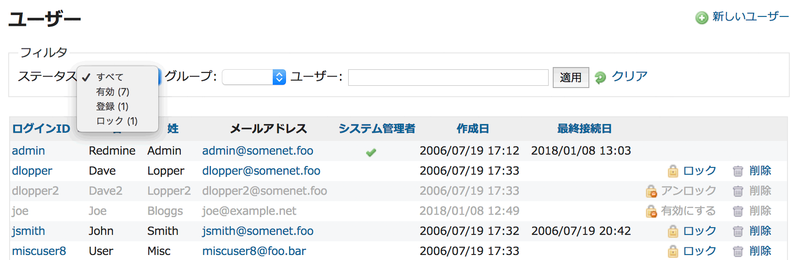

ユーザーに対する管理操作
========================

!!! note ""
    最終更新: 2018/01/08
    [[原文](http://www.redmine.org/projects/redmine/wiki/RedmineUsers/19)]

[TOC]

ユーザー一覧
------------

ユーザー一覧には、デフォルトではすべての有効（アクティブ）なユーザーが表示されます。すべてのユーザー（「有効」「登録」「ロック」状態）の一覧を表示するには、「フィルタ」内の「ステータス」を「すべて」に切り替えてください。

-   **ログイン:** ログインID
-   **名:** 氏名のうち名
-   **姓:** 氏名のうち姓
-   **メールアドレス:** ユーザーのメールアドレス
-   **システム管理者:** アイコン「」はそのユーザーがシステム管理者であることを示します。システム管理者はアプリケーションおよび全プロジェクトに無制限にアクセスできます
-   **作成日:** ユーザーアカウントが作成された日時
-   **最終接続日:** そのユーザーが最後にログインした日時

**アカウントの状態:**

-   **有効**
    -   アイコン「」はアカウントが有効であることを示します。ユーザーはRedmineにログインしアプリケーションを利用できます。
-   **ロック**
    -   アイコン「」はアカウントがロックされていることを示します。ユーザーは以下の状態になります。
        -   Redmineにログインできない
        -   チケットの担当者になれない
        -   チケットのウォッチャーになれない
        -   メール通知が送信されない
        -   プロジェクトの概要画面でメンバーとして表示されない
-   **登録**
    -   アイコン「」はアカウントが登録されているがまだ有効になっていない状態を示します。ユーザーはRedmineにログインできません。この状態は「[ユーザーによるアカウント登録](RedmineSettings#Self-registration)」機能を使用しているとき発生するもので、登録を行ったユーザーに届いた確認メール内に記載されているリンクをクリックしてアカウントを有効にするか、システム管理者が手動で有効にするのを待っている状態です。

「ロック」/「アンロックボタン」はユーザーアカウントをロック/アンロックし、「有効にする」ボタンは「登録」状態のユーザーを有効にします。

ユーザー認証
------------

ユーザーはログインIDとパスワードによって認証されます。認証情報はRedmine自体で管理する方法のほか、外部のLDAPサーバ、OpenIDサーバ、もしくは、例えばApacheの認証を再利用するRedmineプラグインで管理することができます。

詳しくは以下を参照してください。

* [LDAP認証](RedmineLDAP)
* [OpenIDによるログインと登録](RedmineSettings#Allow-OpenID-login-and-registration)

ユーザーの追加・編集
--------------------

「システム管理者」チェックボックスを有効にしたユーザーは、アプリケーションおよび全プロジェクトに無制限にアクセスできます。

編集画面では、ユーザーのパスワードを変更しない場合は「パスワード」フィールドは空白にしておいてください。
