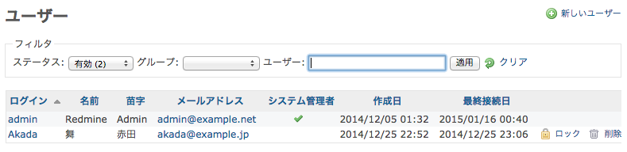

ユーザの管理
============

[TOC]

ユーザー一覧
------------

ユーザー一覧はデフォルトで有効化されたユーザーのみ表示されます。すべてのユーザーを表示する場合はステータスフィルターを「すべて」に変更してください。

-   **ログイン:** ログインID
-   **名前:** ユーザーの名前
-   **苗字:** ユーザーの苗字
-   **メールアドレス:** ユーザーのメールアドレス
-   **システム管理者:** アイコン「」が表示されていれば、そのユーザーがシステム管理者であり、アプリケーションおよび全プロジェクトに無制限にアクセスできることを示します。
-   **作成日:** ユーザーアカウントが作成された日時
-   **最終接続日:** そのユーザーが最後にログインした日時

**アカウントの状態:**

-   **有効**
    -   アイコン「」はアカウントが有効であることを示します。アカウントが有効であるユーザはRedmineにログインすることができます。
-   **ロック**
    -   アイコン「」はアカウントがロックされていることを示します。ロックされたアカウントを持つユーザーは以下の状態になります。
        -   Redmineにログインできません。
        -   チケットを割り当てることができません。
        -   チケットのウォッチャーに設定できません。
        -   メール通知を受け取ることができません。
        -   プロジェクトの概要画面でメンバーとして表示されません。
-   **Registered**
    -   アイコン「」はアカウントが登録されているがまだ有効になっていない状態も示します。Redmineにログインし、アクセスすることはできません。これはアカウントの登録を自分(ログイン画面)で行った場合に、メール認証を行っていないか、システム管理者が手動で有効化してないときに起こる状態です。

ロック/アンロックボタンで、ユーザアカウントをロック/アンロックできます。

ユーザー認証
------------

ユーザーはログインIDとパスワードによって認証されます。これらのトークンはRedmineにより直接的に、または拡張LDAP、OpenIdサーバ、もしくは既に存在しているApacheの認証を再利用したRedmineプラグインなどによって管理されています。

ユーザーの追加・編集
--------------------

「管理者」チェックボックスを有効にしたユーザは、アプリケーションおよび全プロジェクトに無制限にアクセスできます。

編集画面では、ユーザーのパスワードを変更しない場合は「パスワード」フィールドは空白にしておいてください。
