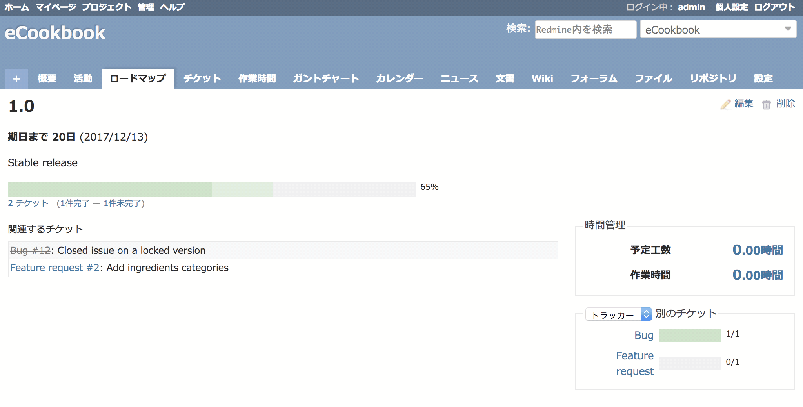

バージョンの概要画面
====================

!!! note ""
    最終更新: 2017/11/23
    [[原文](http://www.redmine.org/projects/redmine/wiki/RedmineVersion/6)]

[TOC]

バージョンの概要画面では、あるバージョンの現時点の全体的な状況が把握できます。

* そのバージョンに割り当てられたチケットの一覧と、進捗率のグラフ。グラフはチケットの進捗率とステータスに基づき、クローズされたチケットのみの進捗率と全体の進捗率が色分けして表示されます。
* そのバージョンに関連づけられたWikiページの内容
* そのバージョンに関連づけられたチケットの予定工数と作業時間の合計が表示される領域
* チケットの統計情報を、以下の項目でグルーピングして表示する領域:
    * 担当者
    * 作成者
    * カテゴリ
    * 優先度
    * トラッカー
    * ステータス

グルーピングのキーと統計情報（チケット数）はドリルダウンリンクとなっていて、作成者やカテゴリなど適切なフィルタが適用されたチケット一覧画面にリンクされています。

バージョンの概要画面は、[ロードマップ](RedmineRoadmap)画面でバージョンをクリックすると表示されます。
