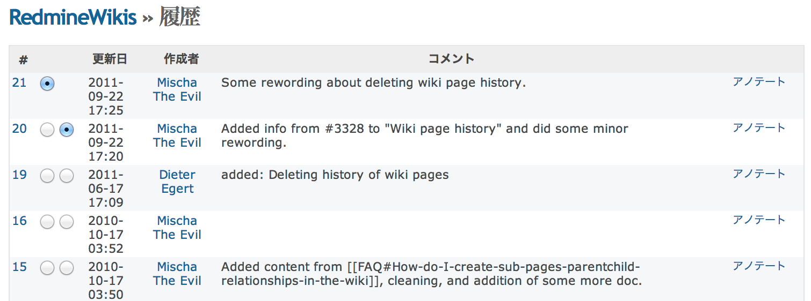
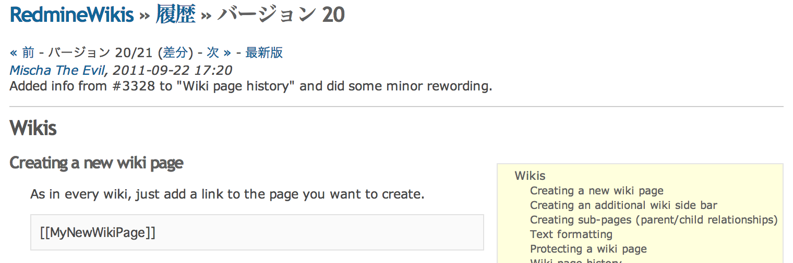

Wiki
====

!!! note ""
    最終更新: 2014/08/19
    [[原文](http://www.redmine.org/projects/redmine/wiki/RedmineWikis/21)]

新しいwikiページの作成
----------------------

各Wikiページの中で、作成したいページへのリンクを追加してください。

``` text
[[MyNewWikiPage]]
```

ページを保存し、そのリンクをクリックしてください: "MyNewWikiPage" という名前のWikiページが作成されたはずです。

wikiのサイドバーの作成
----------------------

Wikiのサイドバーが表示されている状態で `Sidebar` という名前のwikiページを作成すると、そのページの内容がサイドバー上に表示されます。
このページを作成するには「Wikiページの保護」の権限が必要です。

サブページの作成(親/子関係)
---------------------------

親子の関係を持つWikiページを作成できます。これには2つの利点があります:

-   「索引(名前順)」で表示した場合、ページのツリー構造は親子関係に沿って並び替えられます:

``` text
* Guide
  * RedmineAccounts
  * RedmineCustomFields
  * RedmineInstall
  * RedmineIssueList
  * RedmineIssues
```

-   それぞれの子ページにパンくずリストが表示され、ツリー構造内でのそのページの位置が表示されます:
    TODO, add image

このような関係は、子ページとなるページに対して親ページを割り当てることで設定できます。これは `名前変更` ダイアログ内でのみ指定可能です。
したがって、親ページと子ページを両方作成した後に子にしたいページを開き、"名前変更"をクリックし、そして親ページの名前を選択して"保存"をクリックしてください。

テキストの書式
--------------

[Redmineにおけるwiki記法](http://redmine.jp/tech_note/RedmineWikiFormatting/) をご覧ください。

Wikiページの保護
----------------

「Wikiページの編集」権限があれば、  **ロック** をクリックできます。

ロックされたWikiページは「Wikiページの保護」権限を持つユーザーのみが編集できます。
また、これらのユーザーは  **アンロック** をクリックするとロックを解除できます。

Wikiページの履歴
----------------

RedmineはWikiページに対して加えられたすべての変更の履歴を保存しています。  **履歴** をクリックすることで、これらの一覧を表示できます。



ページの特定のバージョンを見るには、バージョンの番号をクリックします。



この画面の表示は誤解されることがあります: `バージョン 20/21 (差分)` というのは、全部で21のバージョンのうち20番目を表示しているということを意味していて、「差分」をクリックするとバージョン20と21の間の変更点が表示されるのではありません。「差分」をクリックすると表示されるのはバージョン19と20の間の変更点です。もし現在バージョン19を見ているのであれば「バージョン 19/21」と表示され、「差分」をクリックするとバージョン19で加えられた変更点が表示されます。

もしバージョン20と21の間の差分を見たいのであれば、「履歴」を表示して "差分を見る" をクリックして下さい(最新バージョンの差分がデフォルトで表示されます)。

 **このバージョンにロールバック** をクリックして **保存** すると、ページの内容を過去のバージョンのものに戻すことができます。このとき、新しい履歴が作成されるので過去の履歴を失う事はありません。

ページの履歴を全て消去したい場合は、まず残したいページの内容をどこかに保存(編集画面を表示してコピー/ペースト)し、一旦ページを削除して同じ名前で作り直してください。その後、別の場所に保存していた内容を再度コピー/ペーストして下さい。

サイドバー
----------

Wikiページの右側にあるサイドバーには以下のリンクがあります:

-   **メインページ**: 「設定」タブで設定した、Wikiのメインページ
-   **索引(名前順)**: 全Wikiページの名前順索引(さらに、親子関係が設定されていれば親の下位層に子が表示される)

TODO, add image

-   **索引(日付順)**: 全Wikiページの最終変更日時順の索引

TODO, add image
